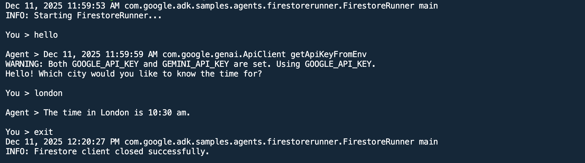

# Weather Forecasting Agent with Google ADK and Firestore for persistant user sessions

This sample application demonstrates a Sample Weather Agent built using the Google Agent Development Kit (ADK) for Java. The agent leverages Firestore for storing user session data to database. This allows the agent to maintain context across multiple interactions with users and in distributed environments.

## Features ✨

- **AI-Powered Forecasting**: Utilizes a Large Language Model (LLM) (e.g., Gemini) to understand user requests and invoke Function.
- **Firebase Integration**: Uses `Firestore` to store user session data.
- **Interactive CLI**: Allows users to interact with the agent, request forecasts, and receive results and insights.

## Prerequisites ✅

- **Java Development Kit (JDK)**: Version 17 or higher. (Official downloads: [Oracle JDK](https://www.oracle.com/java/technologies/javase/jdk17-archive-downloads.html), [OpenJDK](https://openjdk.java.net/projects/jdk/17/))
- **Apache Maven**: To build the project. (Official download: [Apache Maven](https://maven.apache.org/download.cgi))
- **Google Cloud SDK (gcloud CLI)**: Installed and authenticated. (Installation guide: [Google Cloud SDK](https://cloud.google.com/sdk/docs/install))
- **Google Cloud Project**:

* A Google Cloud Project with billing enabled.
* Firestore API enabled in the project.
* Service account with appropriate permissions to access Firestore.

- **Firestore Database**: Set up in Native mode.
- **Google ADK for Java**: Ensure you have access to the Google Agent Development Kit for Java.
- **LLM Access**: Access to a Large Language Model (e.g., Gemini) via Google Cloud.

## Setup and Local Execution 🛠

```xml
<dependencies>
    <!-- ADK Core -->
    <dependency>
        <groupId>com.google.adk</groupId>
        <artifactId>google-adk</artifactId>
        <version>1.0.0</version>
    </dependency>
    <!-- Firestore Session Service -->
    <dependency>
        <groupId>com.google.adk</groupId>
        <artifactId>firestore-session-service</artifactId>
        <version>1.0.0</version>
    </dependency>
</dependencies>
```

```gradle
dependencies {
    // ADK Core
    implementation 'com.google.adk:google-adk:1.0.0'
    // Firestore Session Service
    implementation 'com.google.adk.contrib:firestore-session-service:1.0.0'
}
```

```
mvn clean compile exec:java -Dexec.mainClass="com.google.adk.samples.agents.firestorerunner.FirestoreRunner"

```

## Test the local agent 🤖

Once the application is running, you can interact with the agent via the CLI. You can request weather forecasts and see how the agent utilizes Firestore to store session data.

The sample console output is below: (console_output.png)



## Customization 🎨

You can custoimize the firestore collection name

```properties
# Firestore collection name for storing session data
adk.firestore.collection.name=adk-session
# Google Cloud Storage bucket name for artifact storage
adk.gcs.bucket.name=your-gcs-bucket-name
#stop words for keyword extraction
adk.stop.words=a,about,above,after,again,against,all,am,an,and,any,are,aren't,as,at,be,because,been,before,being,below,between,both,but,by,can't,cannot,could,couldn't,did,didn't,do,does,doesn't,doing,don't,down,during,each,few,for,from,further,had,hadn't,has,hasn't,have,haven't,having,he,he'd,he'll,he's,her,here,here's,hers,herself,him,himself,his,how,i,i'd,i'll,i'm,i've,if,in,into,is
```
