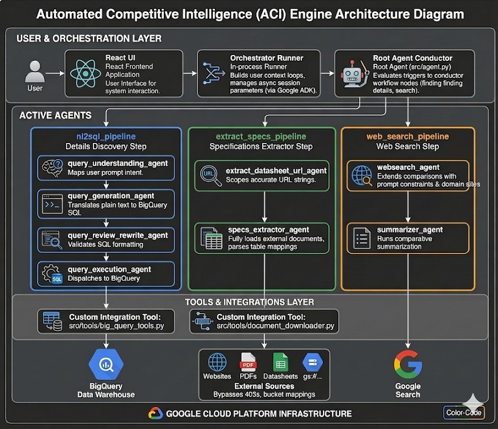

# Competitive Intelligence Engine

[](https://ssh.cloud.google.com/cloudshell/editor?cloudshell_git_repo=GITHUB_URL)

## Overview

The Automated Competitive Intelligence (ACI) Engine is a reusable, AI-powered framework for discovering, analyzing, and comparing competitor products. It automates the process of extracting structured data from unstructured public sources (like websites and PDFs) to provide real-time, actionable market insights.

Built on Google Cloud and Vertex AI, this project transforms competitive analysis from a static, manual task into a dynamic, ever-current stream of intelligence.

## Features

- **Automated Data Discovery**: Finds relevant competitor assets like websites and product datasheets.
- **Intelligent Data Extraction**: Uses generative AI to extract structured specifications from unstructured text and documents.
- **Side-by-Side Comparison**: Generates actionable, comparative reports from the extracted data.
- **Cloud-Native & Scalable**: Built on Google Cloud for robust and scalable operation.
- **Agent-Based Architecture**: Employs a modern, agent-based system for dynamic intelligence gathering.

## Architecture

The engine is built on a **Hierarchical Agent Orchestration** model with discrete modules executing specific workflow components, communicating via structured memory contexts. 

### Diagrammatic Representation



### 🖥️ UI & Orchestration Layer
*   **React + Tailwind Frontend (`frontend/src/`)**: A sleek, modern dashboard utilizing custom `useAgentStream.ts` hooks to gracefully manage asynchronous Server-Sent Events (SSE) from the backend. Incorporates strict presentation boundaries, masking internal data queries behind an elegant "Thinking..." animation, and beautifully renders AI tables via `react-markdown` and `remark-gfm`.
*   **FastAPI Backend (`src/api/main.py`)**: High-performance asynchronous API tier executing the ADK `Runner`. The SSE endpoints operate with intelligent `O(1)` routing filters, guaranteeing that unstructured intermediate "thought" logs from sub-agents never leak to the UI.
*   **Root agent (`src/agent.py`)**: Acts as the comprehensive workflow conductor. It operates with **Mandatory Sequential Gating**, specifically prompting the user for confirmation after each distinct analysis phase before cascading context into deeper loops.

### 🚀 Performance & Observability
*   **Data Aggregation Scaling**: All array generations dynamically execute using C-compiled List Comprehensions across `big_query_tools.py`, turning previously heavy `O(N)` Python method bottlenecks into lightning-fast memory allocations. Network ingestion via `document_downloader.py` leverages `O(1)` streaming `AIOFile` chunking natively over HTTP to prevent RAM exhaustion.
*   **Comprehensive Testing**: Unit-tested leveraging Python's `pytest` framework (`/tests/`), heavily utilizing `unittest.mock.patch` over `httpx.AsyncClient` and BigQuery to simulate end-to-end data throughput pipelines and validate SSE author filtering securely without exhausting Cloud credits.

### 🤖 Active Agents
The architecture leverages highly specialized sub-pipelines to partition duties:

1.  **Details Discovery Step (`nl2sql_pipeline`)**
    *   **`query_understanding_agent`**: Maps user prompts intent.
    *   **`query_generation_agent`**: Dynamically binds queries translating plain text to BigQuery structured targets.
    *   **`query_review_rewrite_agent`**: Validates SQL formatting buffers.
    *   **`query_execution_agent`**: Dispatches standard execution calls to BQ environments securely.
2.  **Specifications Extractor Step (`extract_specs_pipeline`)**
    *   **`extract_datasheet_url_agent`**: Scopes accurate URL strings.
    *   **`specs_extractor_agent`**: Fully loads external documents, executing rigid specifications parse table mappings.
3.  **Web Search Step (`web_search_pipeline`)**
    *   **`websearch_agent`**: Extends competitive comparisons using dynamic prompt overlays. Includes strict domain site constraints (e.g., appending site domains based on Industry setups to narrow Google Search loops).
    *   **`summarizer_agent`**: Runs standard comparative summarization node layouts over downstream inputs.

### 🛠️ Custom Integration Tools (`src/tools/`)
*   **BigQuery Tools (`big_query_tools.py`)**: Extracts tabular layouts metadata securely.
*   **Document Downloader (`document_downloader.py`)**: Generalized pipeline fully equipped to bypass 403 hurdles mapping direct `gs://...` or authenticated bucket payloads to rich text files accurately. Holds standalone garbage triggers to keep disks clean.

## Getting Started

For installation of this solution, one can follow the below procedure:

1. Execute our primary Bash utility (`setup.sh`) which initializes the active Cloud Artifact Registry Repository, validates PyPi dependencies via `uv`, and ensures fundamental IAM permissions are synced to the active `gcloud` identity.

```
chmod +x setup.sh
./setup.sh
```
Note: You may be prompted to authenticate your terminal in standard `gcloud auth login` flows.

2. **Boot the Orchestration Servers Locally**: A dedicated run-script boots both the React client and FastAPI server simultaneously for hot-reload development mapping natively.
```
chmod +x run_local.sh
./run_local.sh
```

### Prerequisites

- Python 3.9+
- [uv](https://github.com/astral-sh/uv) (for package management)
- Access to a Google Cloud project with Vertex AI enabled.

### Installation

1.  **Clone the repository:**
    ```sh
    git clone https://github.com/your-username/competitive-intelligence-engine.git
    cd competitive-intelligence-engine
    ```

2.  **Install dependencies:**
    Use `uv` to install the project dependencies from `pyproject.toml`.
    ```sh
    uv pip install -e .
    ```

3.  **Configure Environment:**
    Create a `.env` file in the root directory and add your Google Cloud project configuration.
    ```env
    # .env
    GOOGLE_CLOUD_PROJECT="your-gcp-project-id"
    GOOGLE_CLOUD_REGION="your-gcp-region"
    ```

4.  **Domain-Aware Search Configuration (Advanced):**
    By default, the Competitive Intelligence Engine performs general Google searches to find competitors. To guarantee high-relevance and prevent hallucinated data from generic consumer sites (e.g., Amazon, Flipkart), you can strictly constrain searches to specific domain authority sites using a JSON string in your `.env`.

    ```env
    # .env
    INDUSTRY_DOMAIN="insurance"
    
    # Configure JSON directly in the .env string or keep it default in the config module.
    # The JSON must map an industry string to a list of allowed search domains.
    DOMAIN_SEARCH_TARGETS_JSON='{"insurance": ["irdai.gov.in", "policybazaar.com"], "electronics": ["siliconexpert.com", "mouser.com", "digikey.com"]}'
    ```
    The engine will dynamically verify `INDUSTRY_DOMAIN`, and inject `site:irdai.gov.in OR site:policybazaar.com` into every search performed by the web research agent.

## Contributing

Contributions to this library are always welcome and highly encouraged.

See [CONTRIBUTING](CONTRIBUTING.md) for more information how to get started.

Please note that this project is released with a Contributor Code of Conduct. By participating in
this project you agree to abide by its terms. See [Code of Conduct](CODE_OF_CONDUCT.md) for more
information.

## License

```
Copyright 2026 Google LLC

Licensed under the Apache License, Version 2.0 (the "License");
you may not use this file except in compliance with the License.
You may obtain a copy of the License at

     http://www.apache.org/licenses/LICENSE-2.0

Unless required by applicable law or agreed to in writing, software
distributed under the License is distributed on an "AS IS" BASIS,
WITHOUT WARRANTIES OR CONDITIONS OF ANY KIND, either express or implied.
See the License for the specific language governing permissions and
limitations under the License.
```