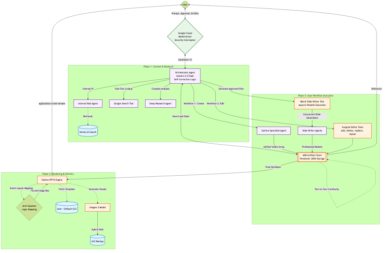

# Brand-Adherent Research & Deck Agent

**Maintainers:** Renee Zhang
**Last Updated:** March 2026  
**Architecture:** Multi-Agent System on Vertex AI  
**Model:** Gemini 2.5 Flash  

---

## 1. Executive Summary
This project implements an advanced AI multi-agent system designed to automate the creation of Brand Adherent PowerPoint presentations. It functions as a specialist tool within the Gemini Enterprise ecosystem, enabling a seamless workflow from deep internet research to final, branded deck generation.

---

## 2. Overview & Capabilities

### Agent Details Table
| Feature | Details |
| :--- | :--- |
| **Interaction Type** | Workflow & Conversational|
| **Complexity** | Advanced |
| **Agent Type** | Multi-Agent |
| **Vertical** | Horizontal / Consulting / Enterprise Strategy |
| **Key Features** | Automated Proposal Generation, Interactive  Editing, RAG, Web Search (Google Search & Deep Research), Stateful Parallel Slide Synthesis, Automated Speaker Citations|

### Core Features

| Feature | Description |
| :--- | :--- |
| **Interactive Workflow** | Supports a "Pause & Review" protocol, allowing users to approve research and briefings before slide generation. Includes editing tools to modify text, layouts, and visuals on demand. |
| **Multi-Agent Core** | Orchestrates specialist agents for Deep Research, Synthesis, and Deck Specification. |
| **Internal RAG** | Connects to Vertex AI Search to retrieve proprietary case studies, previous investment proposals, and frameworks relevant to the specific prompt. |
| **External Grounding** | Uses Google Search and Deep Research API to validate market trends, competitor insights, and economic data. |
| **Brand Compliance** | Renders final assets using an official `.pptx` template (e.g., `Proposal_Template.pptx`) via a dedicated Python rendering engine, matching enterprise slide masters. |
| **Enterprise Scale** | Built on Google Cloud Vertex AI and deployed via Agent Engine for security and scalability.|

---

## 3. Architecture: How it Works

The agent operates as a coordinated pipeline, mimicking the workflow of a human consulting team:

1. **Planning & Research (Internal & External):**
   *   **Internal:** Queries Vertex AI Search for relevant IP and past proposals.
   *   **External:** Queries Google Search / Deep Research for current market context.
2. **Synthesis:** Organizes raw data into a coherent narrative aligned with the firm's value propositions.
3. **Deck Specification:** Generates a DeckSpec (JSON) defining the structure, slide content, targeted bolding, and speaker notes.
4. **Rendering:** Merges the DeckSpec with the corporate PowerPoint Template, generating high-quality images via Imagen 3 where requested.
5. **Output:** Uploads the final `.pptx` to Google Cloud Storage as a secure artifact,also available for direct download within the Gemini Enterprise interface.

### High-Level Architecture


---

## 4. Project Structure

The project follows a modular structure to separate core logic from deployment utilities.

```
.
├── .env                  # Environment variables for configuration
├── pyproject.toml        # Project metadata and dependencies (managed by uv)
├── README.md             # Documentation
├── docs/                 # Architectural diagrams and templates
├── presentation_agent/   # Core logic package
│   ├── __init__.py
│   ├── agent.py          # Main agent definition and ADK runner
│   ├── prompt.py         # Agent instructions and workflows
│   ├── shared_libraries/ # Configs, Data Models (DeckSpec), Utils
│   ├── sub_agents/       # Specialist agents (Deep Research, Synthesis, RAG)
│   └── tools/            # Presentation manipulation and artifact tools
├── deployment/           # Deployment scripts
│   └── deploy.py         # Script to deploy/update the Agent Engine app

```

---

## 5. Getting Started & Setup

### Prerequisites
- Python 3.10+
- Google Cloud SDK installed and authenticated.
- Vertex AI API enabled on your Google Cloud Project.
- **Corporate Template:** A `.pptx` master file stored in a Google Cloud Storage bucket.(docs/pptx_template_guide.md)

### Authentication & IAM Roles
Ensure your service account (or user account) has the following permissions:
- **Vertex AI User** (`roles/aiplatform.user`): For calling Gemini/Imagen.
- **Storage Object Admin** (`roles/storage.objectAdmin`): For reading templates/writing decks.
- **Service Account User** (`roles/iam.serviceAccountUser`): Required for Agent Engine deployment.

### Installation

1. **Clone the Repository**
    ```bash
    git clone <your-repository-url>
    cd <your-repository-directory>
    ```

2. **Configure Environment**
    Create a `.env` file and populate it with your specific resources, following the template:
    ```bash
    cp .env.example .env
    ```

    **Required Variables:**
    - `GOOGLE_CLOUD_PROJECT`: Your Project ID.
    - `GOOGLE_CLOUD_LOCATION`: Region (e.g., `us-central1`).
    - `GEMINI_MODEL_NAME`: e.g., `gemini-2.5-flash`.
    - `IMAGE_GENERATION_MODEL`: e.g., `imagen-3.0-generate-002`.
    - `GCP_STAGING_BUCKET`: Bucket name for artifacts (e.g., `gs://my-bucket`).
    - `DEFAULT_TEMPLATE_URI`: URI of the master template (e.g., `gs://bucket/Proposal_Template.pptx`).
    - `AS_APP`: Gemini Enterprise app ID.
    - `DATASTORE_ID`: Vertex AI Search Datastore ID for internal RAG (Format: `projects/{PROJECT_ID}/locations/{LOCATION}/collections/default_collection/dataStores/{DATA_STORE_ID}`).
    - `ENABLE_RAG`: Set to ‘false’ by default; requires manual RAG database configuration by the user.
    - `ENABLE_DEEP_RESEARCH`: Set to ‘false’ by default; requires project-level allowlisting before activation.

3. **Install Dependencies**
    Using `uv` (recommended):
    ```bash
    uv init
    uv sync
    source .venv/bin/activate
    gcloud auth application-default login
    ```

---

## 6. Local Development & Testing

### Running the Agent Locally
Start the agent's web server locally:
```bash
adk web --port 8000 .
```
You can now interact with the agent by sending prompts to `http://localhost:8000`.

### Evaluation & Testing
We use a dual-evaluation approach testing both structural integrity and narrative quality across the full lifecycle.

1. **Structural & Unit Tests (Pytest)**: Ensures the agent's internal logic, configuration, and PPTX rendering tools handle edge cases gracefully without crashing. Evaluates the `get_smart_layout` fallback logic.
    ```bash
    python -m pytest tests/
    ```

2. **End-to-End Lifecycle Evaluation**: A full mock session testing the multi-agent delegation, JSON generation, physical `.pptx` artifact creation, and subsequent interactive surgical edits. Evaluated via an LLM-as-a-judge framework.
    ```bash
    python -m eval.eval_pipeline
    ```
---

## 7. Customization & Extension

### Modifying the Flow
- **Prompts:** Tweak the core orchestration logic and instructions in `presentation_agent/prompt.py`. This file controls the dual "Create" and "Edit" workflows.
- **Sub-Agents:** Modify sub-agent behaviors (Deep Research, Synthesis) in `presentation_agent/sub_agents/`.

### Adding Tools
To add new external APIs or utilities, place them in `presentation_agent/tools/` and register them as `FunctionTool` objects in the `agent_tools` array within `presentation_agent/agent.py`.

### User-Provided Templates 
Users can provide your own `.pptx` templates. To achieve flawless formatting without the Python engine resorting to programmatic resizing hacks, the provided template should follow (docs/pptx_template_guide.md)

---

## 8. Deployment to Agent Engine & Registration

#### 1. Deploy to Agent Engine
Use the `deploy.py` script located in the `deployment/` folder to containerize and push the agent.

**To Create a New App:**
```bash
python deployment/deploy.py --mode create
```
*Note: This will automatically update the `AGENT_ENGINE_ID` in your `.env` file.*

**To Update an Existing App:**
```bash
python deployment/deploy.py --mode update
```

#### 2. Register to Gemini Enterprise
Once deployed, register the agent so it can be discovered as a Tool/Agent in Gemini Enterprise.

1. Copy the configuration template:
    ```bash
    cd agent_registration.
    cp config_template.json config.json
    ```
2. Fill out `config.json` with your project details, app ID, and the Agent Engine ID (`adk_deployment_id`).
3. Run the registration wrapper:
    ```bash
    python as_registry_client.py register_agent --config config.json
    ```

---
## 9. Demo Flow
The following script demonstrates the standard interacting with the agent via the Gemini Enterprise UI. This 5-turn interaction highlights the iterative "Pause & Review" protocol.

### Turn 1: Initialization & Research Planning
**User Prompt:**
> "I need to build a 15-slide investment proposal for a solar infrastructure project in Irvine. Show me a research plan for how you will validate market growth and ROI using internal data sources and external search results."

**Agent Output:**The agent outlines its strategy, planning to query Vertex AI internal knowledge if have. It pauses for your approval.

### Turn 2: Executing External Research
**User Prompt:**
> "The plan looks good. Execute the research and show me specific findings and citations. Pause here. Do not create the slides until I approve the research results. I want to verify the citations and content quality first."

**Agent Output:**The agent returns a detailed,  markdown summary of solar incentives in Irvine and projected ROI figures based on its web searches. It pauses for your review.

### Turn 3: Outline & Synthesis
**User Prompt:**
> "Looks good. Please generate the slide-by-slide outline using my default template from GCS. Do not generate the final PowerPoint file yet, I want to review the draft outline first."

**Agent Output:**The agent drafts the presentation structure and returns a detailed text-based outline. It pauses for your review.

### Turn 4: Refining the Outline
**User Follow-up Prompt:**
> "Actually, before we generate the slides, can you change the title of slide 6 to 'Projected 5-Year Returns'?"

**Agent Output:**  The agent updates the internal DeckSpec JSON with the requested change.

### Turn 5: Final Presentation Generation
**User Prompt:**
> "The outline is perfect now. Go ahead and generate the final PowerPoint presentation."

**Agent Output:** The agent generate final powerpoint that user can download.
