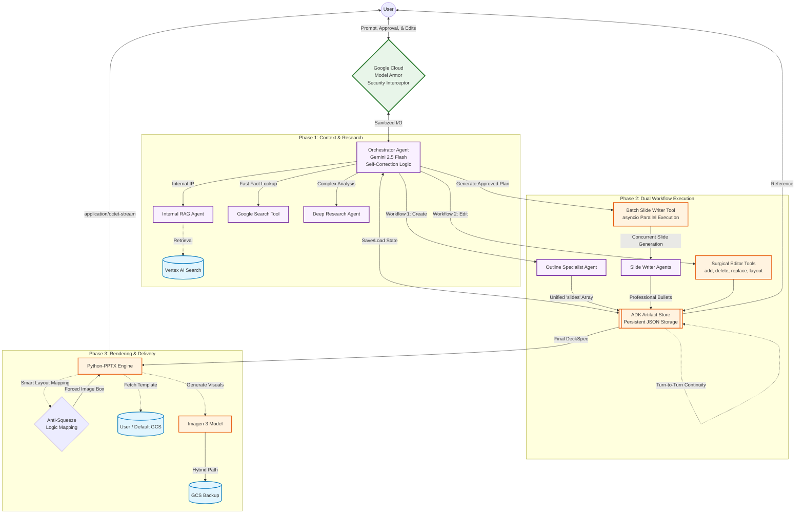

# Presentation Expert Agent - Architecture Diagram

This document illustrates the high-level multi-agent architecture of the Presentation Expert Agent. It highlights the unified data model, enterprise-grade state persistence, and advanced layout safety mapping.

### Architectural Highlights

1. **Stateless State Persistence:** Unlike standard agents that rely on ephemeral memory, this agent uses the **ADK Artifact Store** to persist its state as physical JSON files. This ensures that a 15-slide presentation survives cloud worker node rotations and turn-to-turn transitions.
2. **Unified Data Model (`slides`):** To prevent model confusion and "Malformed Function Call" errors, the entire system uses a single consistent data structure. The same `SlideSpec` model is used for planning (focus instruction) and final output (professional bullets).
3. **Enterprise Security (Model Armor):** All incoming user prompts and outgoing LLM responses pass through asynchronous interceptors (`model_armor.py`). This guarantees fail-closed protection against prompt injections.
4. **Anti-Squeeze Layout Safety:** The rendering engine features a **Smart Layout Guard**. It automatically overrides "squeezed" layout requests (like "Title and Chart") and remaps them to professional alternatives (like "Title and Image") to physically guarantee high-quality visual spacing.
5. **Self-Correction Protocol:** The Orchestrator is equipped with a **3-retry Self-Correction loop**. If a tool call fails due to syntax or network stale connections, the agent autonomously reflects on the error and retries the call with corrected parameters.
6. **Parallel Content Generation:** Latency is minimized by offloading synthesis to the `batch_slide_writer_tool`, which utilizes Python's `asyncio.gather` to generate content for an entire deck concurrently.
