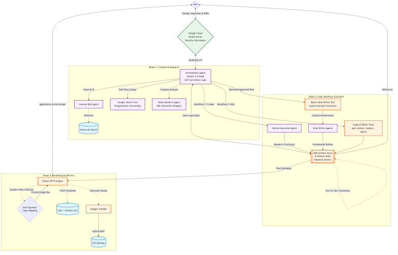

# Brand-Aligned Presentations.

**Architecture:** Multi-Agent System on Vertex AI  
**Model:** Gemini 2.5 Flash or later version

---

## 1. Executive Summary
This project implements an advanced AI multi-agent system designed to automate the creation of Brand Adherent PowerPoint presentations. It functions as a specialist tool within the Gemini Enterprise ecosystem, enabling a seamless workflow from deep internet research to final, branded deck generation.

---

## 2. Overview & Capabilities

### Agent Details Table
| Feature | Details |
| :--- | :--- |
| **Interaction Type** | Workflow & Conversational|
| **Complexity** | Advanced |
| **Agent Type** | Multi-Agent |
| **Vertical** | Horizontal / Consulting / Enterprise Strategy |
| **Key Features** | Automated Proposal Generation, Interactive  Editing, RAG, Web Search (Google Search & Deep Research), Stateful Parallel Slide Synthesis, Automated Speaker Citations|

### Core Features

| Feature | Description |
| :--- | :--- |
| **Interactive Workflow** | Supports a "Pause & Review" protocol, allowing users to approve research and briefings before slide generation. Includes editing tools to modify text, layouts, and visuals on demand. |
| **Multi-Agent Core** | Orchestrates specialist agents for Deep Research, Synthesis, and Deck Specification with strict data provenance. |
| **Programmatic Citation Integrity** | Uses custom tool wrappers to programmatically extract verified URLs from grounding metadata, ensuring 100% citation accuracy in speaker notes. |
| **Research Continuity** | Implements a "Research Anchor" logic in session state, strictly preserving Phase 1 research results and raw URLs across all subsequent outline revisions and slide generation turns. |
| **Internal RAG** | Connects to Vertex AI Search to retrieve proprietary case studies and frameworks. |
| **External Grounding** | Uses Google Search and Deep Research API to validate market trends and competitor insights. |
| **Brand Compliance** | Renders final assets using an official `.pptx` template via a dedicated Python rendering engine, matching enterprise slide masters. |
| **Enterprise Scale** | Built on Google Cloud Vertex AI and deployed via Agent Runtime for security and scalability.|

---

## 3. Architecture: How it Works

The agent operates as a coordinated pipeline, mimicking the workflow of a human consulting team:

1. **Planning & Research (Internal & External):**
   *   **Internal:** Queries Vertex AI Search for relevant IP and past proposals.
   *   **External:** Queries Google Search / Deep Research for current market context.
2. **Synthesis:** Organizes raw data into a coherent narrative aligned with the firm's value propositions.
3. **Deck Specification:** Generates a DeckSpec (JSON) defining the structure, slide content, targeted bolding, and speaker notes.
4. **Rendering:** Merges the DeckSpec with the corporate PowerPoint Template, generating high-quality images via Imagen 3 where requested.
5. **Output:** Uploads the final `.pptx` to Google Cloud Storage as a secure artifact,also available for direct download within the Gemini Enterprise interface.

### High-Level Architecture


---

## 4. Project Structure

The project follows a modular structure to separate core logic from deployment utilities.

```
.
├── .env                  # Environment variables for configuration
├── pyproject.toml        # Project metadata and dependencies (managed by uv)
├── README.md             # Documentation
├── docs/                 # Architectural diagrams and templates
├── presentation_agent/   # Core logic package
│   ├── __init__.py
│   ├── agent.py          # Main agent definition and ADK runner
│   ├── prompt.py         # Agent instructions and workflows
│   ├── shared_libraries/ # Configs, Data Models (DeckSpec), Utils
│   ├── sub_agents/       # Specialist agents (Deep Research, Synthesis, RAG)
│   └── tools/            # Presentation manipulation and artifact tools
├── deployment/           # Deployment scripts
│   └── deploy.py         # Script to deploy/update the Agent Engine app

```

---

## 5. Getting Started & Setup

### Prerequisites
- Python 3.10+
- Google Cloud SDK installed and authenticated.
- Vertex AI API enabled on your Google Cloud Project.
- **Corporate Template:** A `.pptx` master file stored in a Google Cloud Storage bucket.(docs/pptx_template_guide.md)

### Authentication & IAM Roles
Ensure your service account (or user account) has the following permissions:
- **Vertex AI User** (`roles/aiplatform.user`): For calling Gemini/Imagen.
- **Storage Object Admin** (`roles/storage.objectAdmin`): For reading templates/writing decks.
- **Service Account User** (`roles/iam.serviceAccountUser`): Required for Agent Runtime deployment.

### Installation

1. **Clone the Repository**
    ```bash
    git clone <your-repository-url>
    cd <your-repository-directory>
    ```

2. **Configure Environment**
    Create a `.env` file and populate it with your specific resources, following the template:
    ```bash
    cp .env.example .env
    ```

    **Required Variables:**
    - `GOOGLE_CLOUD_PROJECT`: Your Google Cloud Project ID.
    - `GOOGLE_CLOUD_LOCATION`: The target region (e.g., `us-east1`).
    - `GEMINI_MODEL_NAME`: The spefcific LLM version to use (e.g., `gemini-2.5-flash`).
    - `IMAGE_GENERATION_MODEL`:The Imagen model version (e.g., `imagen-3.0-generate-002`).
    - `GCP_STAGING_BUCKET`: GCS Bucket name for storing artifacts (e.g., `gs://my-bucket`). If not provided, a new bucket named `YOUR_PROJECT_ID-staging-bucket` will be created in the `GOOGLE_CLOUD_LOCATION` (defaults to `us-east1`).
    - `DEFAULT_TEMPLATE_URI`: GCS URI of the master PowerPoint template (e.g., `gs://bucket/Proposal_Template.pptx`). If not provided, the default `docs/Proposal_Template.pptx` will be uploaded to your `GCP_STAGING_BUCKET` and used automatically.
    - `AS_APP`: The Gemini Enterprise App ID.
    - `DATASTORE_ID`: (Optional) Full path to the Vertex AI Search Datastore for internal RAG.(Format: `projects/{PROJECT_ID}/locations/{LOCATION}/collections/default_collection/dataStores/{DATA_STORE_ID}`).
    - `ENABLE_RAG`: (Default :false) Set to true to enable RAG database if DATASTORE_ID provided.
    - `ENABLE_DEEP_RESEARCH`: (Default:false) Requires project-level allowlisting before activation.
    - `MODEL_ARMOR_TEMPLATE_ID`: (Optional) The ID for the Model Armor security template to inspect model safety.

3. **Install Dependencies**
    Using `uv` (recommended):
    ```bash
    uv sync --dev
    gcloud auth application-default login
    ```

### Alternative: Using Google Agents CLI

You can also use the [Google Agents CLI](https://github.com/google/agents-cli) to create a production-ready version of this agent with additional deployment options.

**Install the CLI** (one-time):

```bash
uvx google-agents-cli setup
```

**Create the project from this sample** (replace `my-research-deck-agent` with your project name):

```bash
agents-cli create my-research-deck-agent -a adk@brand-aligned-presentations
```

The Google Agents CLI will prompt you to select deployment options and provides additional production-ready features including automated CI/CD deployment scripts.

---

## 6. Local Development & Testing

### Running the Agent Locally
Start the agent's web server locally:
```bash
uv run adk web --port 8000 .
```
You can now interact with the agent by sending prompts to `http://localhost:8000`.

### Evaluation & Testing
We use a dual-evaluation approach testing both structural integrity and narrative quality across the full lifecycle.

1. **Structural & Unit Tests (Pytest)**: Ensures the agent's internal logic, configuration, and PPTX rendering tools handle edge cases gracefully without crashing. Evaluates the `get_smart_layout` fallback logic.
    ```bash
    uv run pytest tests/
    ```

2. **End-to-End Lifecycle Evaluation**: A full mock session testing the multi-agent delegation, JSON generation, physical `.pptx` artifact creation, and subsequent interactive surgical edits. Evaluated via an LLM-as-a-judge framework.
    ```bash
    uv run python -m eval.eval_pipeline
    ```
---

## 7. Customization & Extension

### Modifying the Flow
- **Prompts:** Tweak the core orchestration logic and instructions in `presentation_agent/prompt.py`. This file controls the dual "Create" and "Edit" workflows.
- **Sub-Agents:** Modify sub-agent behaviors (Deep Research, Synthesis) in `presentation_agent/sub_agents/`.

### Adding Tools
To add new external APIs or utilities, place them in `presentation_agent/tools/` and register them as `FunctionTool` objects in the `agent_tools` array within `presentation_agent/agent.py`.

### User-Provided Templates 
Users can provide your own `.pptx` templates. To achieve flawless formatting without the Python engine resorting to programmatic resizing hacks, the provided template should follow (docs/pptx_template_guide.md)

---

## 8. Deployment to Agent Runtime & Registration

#### 1. Deploy to Agent Runtime
Use the `deploy.py` script located in the `deployment/` folder to containerize and push the agent.

**To Create a New App:**
```bash
uv run python deployment/deploy.py --mode create
```
*Note: This will automatically update the `AGENT_ENGINE_ID` in your `.env` file.*

**To Update an Existing App:**
```bash
uv run python deployment/deploy.py --mode update
```

#### 2. Register to Gemini Enterprise
Once deployed, register the agent so it can be discovered as a Tool/Agent in Gemini Enterprise.

1. Copy the configuration template:
    ```bash
    cd agent_registration.
    cp config_template.json config.json
    ```
2. Fill out `config.json` with your project details, app ID, and the Agent Runtime ID (`adk_deployment_id`).
3. Run the registration wrapper:
    ```bash
    python as_registry_client.py register_agent --config config.json
    ```

---
## 9. Example
**User Prompt:** "Create a 10-slide presentation for analyzing investment opportunities in the biotech industry in USA. Use the default template. Don’t generate the presentation until I ask, I need to check the presentation outline first."

**Agent Output:**
Inspect the template and plan the deck outline.
Research investment opportunities  in the biotech industry. (external search)
Search internal docs for methodology.(internal search if provided)
Show the outline of presentation for user approval
 
**User Prompt:** “Outline approved. Please generate the presentation now. Make sure to use my default template, follow the research plan, and use the same layout as the presentation outline above.”

**Agent Output:** Agent generates the powerpoint file and provides a Google Cloud Storage (GCS) URI and a direct download link for the completed PowerPoint presentation.