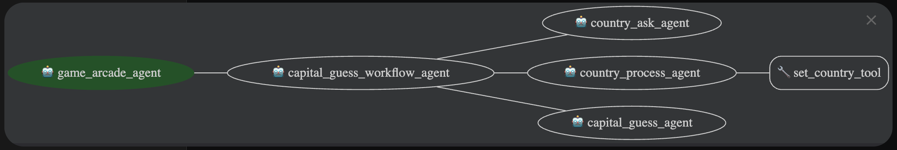

# Capital Guess Game

This sample demonstrates how to build a stateful, conversational agent using the Agent Development Kit (ADK). The agent plays a "Capital Guess Game" with the user, where the agent tries to guess the capital of a country chosen by the user.

This example showcases a multi-agent workflow, state management using session state, and custom agent orchestration.

## Overview

This sample demonstrates a **Human-in-the-Loop (HITL) workflow** where the agent continuously interacts with the user, receives feedback/hint, and refines its responses until the user is satisfied with the result. While presented as a simple game, this pattern is fundamental for building real-world agents that assist users in complex tasks requiring iterative refinement.

The user interacts with a "Game Arcade" agent that initially offers a selection of games. Since there is only one game, the user can choose to play the Capital Guess Game. The game proceeds as follows:

1.  The agent asks the user to pick a country from a predefined list.
2.  The user provides a country name.
3.  The agent makes an initial guess for the capital of that country.
4.  The agent asks the user if the guess is correct.
5.  **Human-in-the-Loop**: The user can respond with "correct" to end the game or provide feedback/hints if the guess is wrong.
6.  The agent uses the user's feedback to make a better guess.
7.  This iterative loop continues until the agent produces a result the user is satisfied with.

### Real-World Applications

This Human-in-the-Loop pattern can be applied to many practical scenarios:
- **Content Creation**: An agent generates drafts and refines them based on user feedback
- **Data Analysis**: An agent analyzes data and adjusts its approach based on user guidance
- **Problem Solving**: An agent proposes solutions and iterates based on user input
- **Design Tasks**: An agent creates designs and modifies them according to user preferences

## Agent Details

The key features of the Capital Guess Game include:

| Feature | Description |
| --- | --- |
| **Interaction Type:** | Conversational |
| **Complexity:**  | Easy |
| **Agent Type:**  | Multi-Agent |
| **Components:**  | Tools, State Management |
| **Vertical:**  | Gaming / Entertainment |

### Agent Architecture

This diagram shows the detailed architecture of the agents and tools used to implement this game workflow.



### Component Details

*   **Agents:**
    *   `game_arcade_agent` - The root agent that greets the user and offers to start the game.
    *   `capital_guess_workflow_agent` - A custom `GameplayAgent` that orchestrates the entire game flow by managing the state and calling other sub-agents.
    *   `country_ask_agent` - Asks the user to choose a country from a specific list.
    *   `country_process_agent` - Processes the user's input to identify and set the chosen country.
    *   `capital_guess_agent` - Guesses the capital of the chosen country, using hints provided by the user.
*   **Tools:**
    *   `set_country_tool` - A tool used by the `country_process_agent` to save the selected country into the session state.
*   **State Management:**
    *   The agent heavily relies on the session state to keep track of the game's progress, including the current `workflow_stage`, the selected `country`, and any `hint` provided by the user.

## Setup and Installation

### Prerequisites

- Python 3.11+
- Poetry
- A project on Google Cloud Platform (if using Vertex AI)

### Installation

1.  Clone the repository:

    ```bash
    git clone https://github.com/google/adk-samples.git
    cd adk-samples/python/agents/capital-guess-game
    ```
    NOTE: From here on, all command-line instructions shall be executed under the directory `capital-guess-game/` unless otherwise stated.

2.  Install dependencies using Poetry:

    ```bash
    poetry install
    ```

3.  Set up your environment.

    Create a `.env` file in the `capital-guess-game/` directory. You can copy the contents from `.env.example` if it exists, or create a new one.
    
    ```bash
    # To use Vertex AI, set to true
    export GOOGLE_GENAI_USE_VERTEXAI=false
    
    # If using Google's generative AI studio (not Vertex AI)
    export GOOGLE_API_KEY=<YOUR_API_KEY>

    # If using Vertex AI
    export GOOGLE_CLOUD_PROJECT=<your-project-id>
    export GOOGLE_CLOUD_LOCATION=<your-project-location>
    ```

4. Authenticate your gcloud account if you are using Vertex AI.
    ```bash
    gcloud auth application-default login
    ```

## Running the Agent

### Using `adk`

ADK provides convenient ways to bring up agents locally and interact with them.
You may talk to the agent using the CLI:

```bash
# Under the capital-guess-game directory:
adk run capital_guess_game
```

or via its web interface:
```bash
# Under the capital-guess-game directory:
adk web
```

This will start a local web server on your machine. You may open the URL, select "capital_guess_game" in the top-left drop-down menu, and a chatbot interface will appear on the right.

### Example Interaction

Below is an example interaction with the Capital Guess Game agent.

```
You: Hi
Agent: Hello! I'm Game Arcade AI agent, your personal game assistant.

A. **Play the game of guessing the capital of a country**
B. **Exit**

Please choose one of the above options.
You: A
Agent: Let's start with some easy country, choose one from this list: France, Germany, India, USA, Japan
You: India
Agent: I think the capital of India is Beijing. Do you think my guess is correct?
You: No, the first letter is N
Agent: I think the capital of India is New Delhi. Do you think my guess is correct?
You: Correct!
Agent: I am a champ, I got the capital right. This was fun. Thank you!
```

## Running Tests

To run the tests, install the dev dependencies and run `pytest`:

```bash
poetry install --with dev
pytest
```

## Customization

You can customize and extend this agent in several ways:

*   **Add more content:** Expand the list of countries and capitals in `sub_agents.py` to make the game more challenging.
*   **Improve guessing logic:** Modify the `capital_guess_agent`'s prompt and logic to make smarter guesses based on user hints.
*   **Add more games:** Create new workflow agents and add them to the `game_arcade_agent` to build a true multi-game arcade.

## Disclaimer

This agent sample is provided for illustrative purposes only and is not intended for production use. It serves as a basic example of an agent and a foundational starting point for individuals or teams to develop their own agents.
