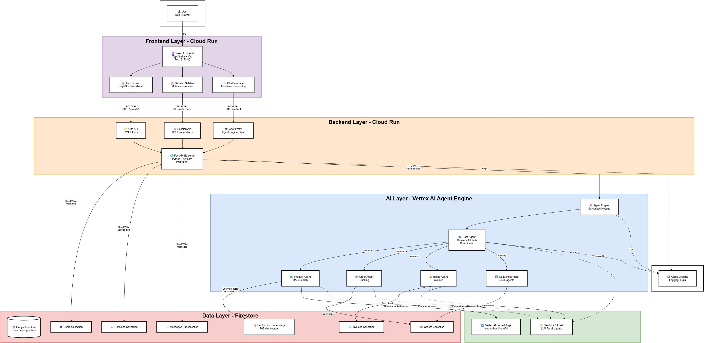

# Multi-Agent AI on GCP: Production-Ready Template

[](../../generate)

Reference implementation of a customer support system built with Google ADK and Gemini 2.5 Pro, demonstrating production patterns: multi-agent orchestration, RAG, Memory Bank, 5-stage evaluation, CI/CD pipelines, Model Armor, Firestore, Cloud Run, and full infrastructure-as-code with Terraform.

> **Getting started?** See **[GETTING_STARTED.md](./GETTING_STARTED.md)**

---

## Business Context

Built for a **consumer electronics and office furniture e-commerce store** (similar to Best Buy or Newegg). The AI agents handle:

| Domain | Examples |
|--------|----------|
| Products | Laptops, headphones, keyboards, office chairs, standing desks |
| Orders | Tracking shipments, delivery status, order history |
| Billing | Invoices, payment status, receipts |
| Refunds | 30-day return window, validated refund processing |

The architecture can be adapted to other retail domains by modifying the product catalog and business rules.

For live demo scenarios and test data reference: [docs/TESTING_SCENARIOS.md](./docs/TESTING_SCENARIOS.md)

---

## Architecture



- **Frontend:** React/TypeScript on Cloud Run
- **Backend:** FastAPI + Cloud Proxy on Cloud Run
- **AI Layer:** Vertex AI Agent Engine with multi-agent orchestration
- **Data Layer:** Firestore with vector search, Memory Bank for cross-session memory

For full details: [docs/ARCHITECTURE.md](./docs/ARCHITECTURE.md)

---

## Key Features

| Feature | Implementation | Notes |
|---------|----------------|-------|
| Multi-Agent Orchestration | Root + 3 Specialists + Workflow agents | Cost-optimized with Gemini 2.5 Pro + Flash |
| Sequential Workflows | 3-step refund validation pipeline | Validation gates prevent invalid operations |
| Session Management | Vertex AI Agent Engine sessions | Backend proxy with JWT auth + multi-user support |
| Memory Bank | Vertex AI Memory Bank with callbacks | Cross-session preference recall |
| Observability | LoggingPlugin + Cloud Logging | Production-ready monitoring |
| Evaluation & Testing | Vertex AI Gen AI Evaluation + AgentEvaluator | 5-stage eval: local → CI → staging → prod → nightly, with eval-gated canary |
| RAG Semantic Search | text-embedding-004 (768-dim) | Vector search on products |
| CI/CD | Cloud Build | Full pipeline with eval gating across dev/staging/prod |
| Post-Deploy Eval | Vertex AI Gen AI Evaluation Service | Live agent scoring after deploy |
| Infrastructure as Code | Terraform | Multi-environment (dev/staging/prod) with GCS remote state |
| Resilience | Circuit breaker + exponential backoff | Protects Agent Engine calls: CLOSED/OPEN/HALF_OPEN, 5-failure threshold, 1s→60s retry |

---

## Agent Architecture

The system uses a root agent that routes each request to the right specialist:

```
User message
    └─► Root Agent (Gemini 2.5 Pro)
            ├─► Product Agent   (Gemini 2.5 Flash)
            ├─► Order Agent     (Gemini 2.5 Flash)
            ├─► Billing Agent   (Gemini 2.5 Flash)
            └─► Refund Workflow (SequentialAgent)
                    ├─► Step 1: Validate order
                    ├─► Step 2: Check eligibility
                    └─► Step 3: Process refund
```

**Product Agent** defaults to `get_product_info` — a smart unified tool that fetches details + inventory + reviews in one call. Individual tools (`get_product_details`, `check_inventory`, `get_product_reviews`) are only used when the user explicitly requests specific data.

**Refund Workflow** is a `SequentialAgent` — the only path to process a refund. Each step must pass before the next runs, preventing invalid refunds.

---

## Technology Stack

**Frontend:** React 18 · TypeScript · Vite

**Backend:** FastAPI · Python 3.11 · Pydantic

**AI/ML:** Google ADK · Gemini 2.5 Pro/Flash · Vertex AI Agent Engine · Vertex AI Memory Bank · text-embedding-004

**Data:** Firestore (NoSQL + vector search)

**Infrastructure:** Cloud Run · Artifact Registry · Docker · Cloud Build · Terraform

**Testing:** pytest · AgentEvaluator · Vertex AI Gen AI Evaluation Service

---

## Evaluation Strategy

Three test layers run before every deployment:

| Layer | What it tests | Cost |
|-------|--------------|------|
| `make test-tools` | Pure Python tool functions, no LLM | Free |
| `make test-unit` | Single-agent behavior via AgentEvaluator | Low |
| `make test-integration` | Multi-agent handoffs through root agent | Low |

All three support switchable eval profiles via `EVAL_PROFILE`:

| Profile | Metrics | When |
|---------|---------|------|
| `fast` | Rouge-1 only | PRs (free, no LLM judge) |
| `standard` | + tool name F1 / rubric LLM judge | Push to main (default) |
| `full` | + final response match v2 | Nightly |

Plus post-deploy evaluation against the live Agent Engine using Vertex AI Gen AI Evaluation Service (`make eval-post-deploy ENV=staging`).

All pre-deploy tests run against in-memory mocks — no live Firestore or RAG calls.

See [docs/EVALUATION.md](./docs/EVALUATION.md) for the full strategy.

---

## CI/CD

Single `main` branch. Environment promotion via git tags:

| Event | What runs |
|-------|-----------|
| PR to `main` (no agent changes) | Fast eval + lint (free) |
| PR to `main` (agent code changed) | + integration eval with LLM judge (auto) |
| Push to `main` | CI + deploy to dev |
| Tag `v*.*.*-rc.*` | Staging deploy + load tests + eval |
| Tag `v*.*.*` | Prod shadow deploy + eval gate + canary |
| Nightly (Cloud Scheduler) | Regression monitoring + auto canary promote/rollback |

See [docs/CI_CD.md](./docs/CI_CD.md) for full pipeline details.

---

## Security

[Model Armor](https://cloud.google.com/model-armor/docs) screens every Gemini call for prompt injection, jailbreaks, and harmful content — automatically, with no changes to agent code. Managed via Terraform per environment.

---

## Documentation

| Document | What it covers |
|----------|---------------|
| [GETTING_STARTED.md](./GETTING_STARTED.md) | Start here: local setup, single-env deploy, multi-env |
| [docs/ARCHITECTURE.md](./docs/ARCHITECTURE.md) | System design, agent hierarchy, data flow |
| [docs/DEPLOYMENT.md](./docs/DEPLOYMENT.md) | Multi-environment Terraform + CI/CD setup |
| [docs/CI_CD.md](./docs/CI_CD.md) | Cloud Build pipelines, triggers, branch strategy |
| [docs/EVALUATION.md](./docs/EVALUATION.md) | 5-stage eval architecture + post-deploy eval |
| [docs/TESTING_SCENARIOS.md](./docs/TESTING_SCENARIOS.md) | Demo scenarios, test data, credentials |
| [docs/PREREQUISITES.md](./docs/PREREQUISITES.md) | GCP APIs, IAM roles, manual setup |
| [docs/ENV_SETUP.md](./docs/ENV_SETUP.md) | All environment variables explained |
| [docs/MEMORY_BANK.md](./docs/MEMORY_BANK.md) | Memory Bank implementation details |
| [docs/DATA_MODEL.md](./docs/DATA_MODEL.md) | Firestore collections and schema |

---

## Resources

- [Google ADK Documentation](https://cloud.google.com/vertex-ai/docs/agent-builder)
- [Vertex AI Agent Engine](https://cloud.google.com/vertex-ai/docs/reasoning-engine)
- [Firestore Vector Search](https://cloud.google.com/firestore/docs/vector-search)
- [Vertex AI Gen AI Evaluation](https://cloud.google.com/vertex-ai/generative-ai/docs/models/evaluation-overview)

## License

Apache 2.0 — see [LICENSE](./LICENSE) file for details.
