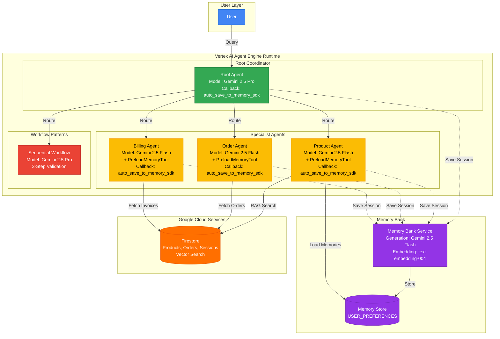
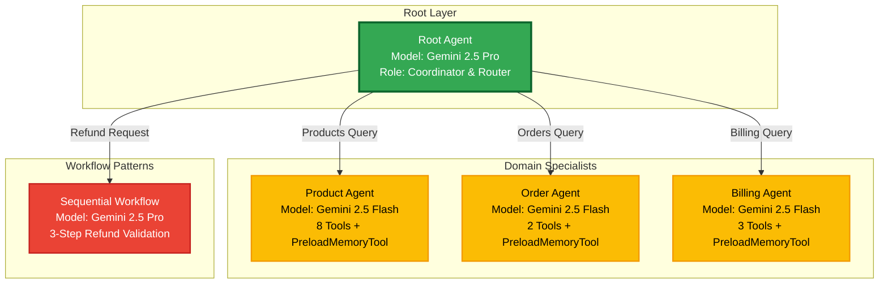
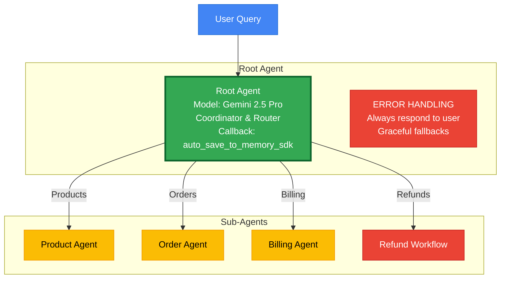
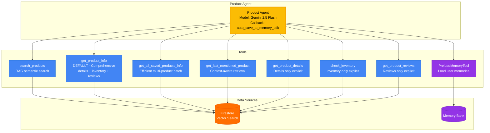
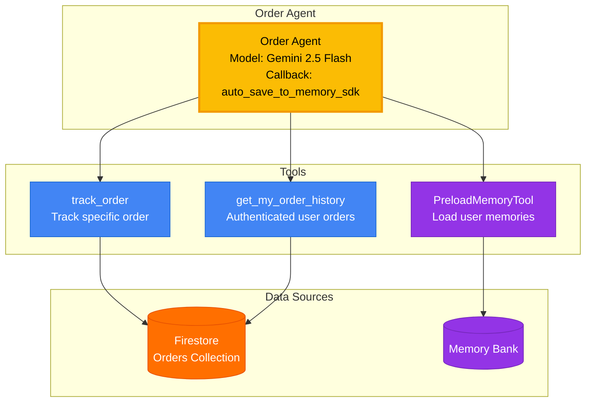
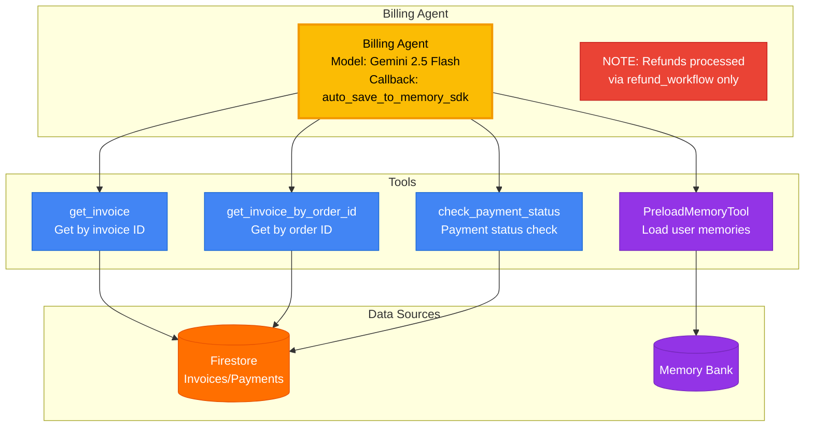

# System Architecture

Multi-agent customer support system with RAG, Memory Bank, and sequential workflow pattern for validated refund processing.

## Architecture Diagrams

Interactive architecture diagrams are available in [`docs/diagrams/`](./diagrams/). GitHub renders these automatically. See [`docs/diagrams/README.md`](./diagrams/README.md) for full details.

## Overview

The system consists of multiple layers:
- **Frontend Layer** - React/TypeScript UI on Cloud Run
- **Backend Layer** - FastAPI + Cloud Proxy on Cloud Run
- **AI Layer** - Vertex AI Agent Engine with multi-agent system
- **Data Layer** - Firestore for products, orders, sessions, and Memory Bank

## System Overview



Full diagram: [`docs/diagrams/system-overview.mmd`](./diagrams/system-overview.mmd)

This diagram shows the complete flow from user queries through the Root Agent coordinator to specialist agents, with Memory Bank integration and data sources.

## Agent System



Full diagram: [`docs/diagrams/agent-hierarchy.mmd`](./diagrams/agent-hierarchy.mmd)

The multi-agent hierarchy shows the Root Agent coordinator routing to specialist agents (Product, Order, Billing) and the Sequential Refund Workflow.

### 1. Root Agent (Coordinator)



Full diagram: [`docs/diagrams/root-agent.mmd`](./diagrams/root-agent.mmd)

**Role:** Routes requests to specialist agents

**Model:** Gemini 2.5 Pro

**Callback:** `auto_save_to_memory_sdk` - Saves full conversation to Memory Bank

**Tools:**
- product_agent (AgentTool)
- order_agent (AgentTool)
- billing_agent (AgentTool)
- refund_workflow (AgentTool)

**Routing Logic:**
```python
# customer_support_mas/agents/root/agent.py

Products → product_agent
Orders → order_agent
Billing → billing_agent
Refunds → refund_workflow
```

### 2. Product Agent (Specialist)



Full diagram: [`docs/diagrams/product-agent.mmd`](./diagrams/product-agent.mmd)

**Role:** Handles product search, details, inventory, reviews

**Model:** Gemini 2.5 Flash

**Tools:**
- `PreloadMemoryTool` - Loads user memories at session start (budget preferences, product interests)
- `search_products` - RAG semantic search with Firestore vector search
- **`get_product_info`** - **Smart unified tool (DEFAULT)** - Fetches details + inventory + reviews comprehensively
- `get_all_saved_products_info` - Efficient multi-product fetch for all products from last search
- `get_last_mentioned_product` - Context-aware retrieval from session state
- `get_product_details` - Fetch only details (for explicit "ONLY details" requests)
- `check_inventory` - Stock levels only (for explicit "ONLY inventory" requests)
- `get_product_reviews` - Customer reviews only (for explicit "ONLY reviews" requests)

**Callback:** `auto_save_to_memory` - Saves conversations to Memory Bank

**Features:**
- **Memory-aware responses** - Explicitly acknowledges remembered budget preferences
- **Smart default behavior** - Comprehensive info by default, specific only when requested
- **Session state management** - Tracks last search, product IDs for follow-ups
- **Efficient multi-product handling** - Single call instead of iteration

**File:** `customer_support_mas/agents/product/agent.py`

### 3. Order Agent (Specialist)



Full diagram: [`docs/diagrams/order-agent.mmd`](./diagrams/order-agent.mmd)

**Role:** Order tracking and history

**Model:** Gemini 2.5 Flash

**Tools:**
- `PreloadMemoryTool` - Loads user memories at session start
- `track_order` - Track by order ID
- `get_my_order_history` - Authenticated user's orders

**Callback:** `auto_save_to_memory_sdk` - Saves conversations to Memory Bank

**Features:**
- Automatic user authentication
- Memory-aware (past delivery issues)

**File:** `customer_support_mas/agents/order/agent.py`

### 4. Billing Agent (Specialist)



Full diagram: [`docs/diagrams/billing-agent.mmd`](./diagrams/billing-agent.mmd)

**Role:** Invoices, payments, refunds

**Model:** Gemini 2.5 Flash

**Tools:**
- `PreloadMemoryTool` - Loads user memories at session start
- `get_invoice` - Get by invoice ID
- `get_invoice_by_order_id` - Get by order ID
- `check_payment_status` - Payment status

**Note:** Refunds are processed through the dedicated `refund_workflow` (SequentialAgent) for proper validation, not directly through billing_agent.

**Callback:** `auto_save_to_memory_sdk` - Saves conversations to Memory Bank

**File:** `customer_support_mas/agents/billing/agent.py`

## Workflow Patterns

### Smart Tool Wrapper

**Use Case:** Get comprehensive product info by default

**Code:** `customer_support_mas/agents/product/tools.py` - `get_product_info()`

Fetches details + inventory + reviews in one call. Deterministic and simple.

### SequentialAgent - Stepwise Validation

**Use Case:** Refund workflow with validation gates

**Example:** "I want a refund for order ORD-12345"

**Execution:**
```
Step 1: Validate Order
   ↓ (if valid)
Step 2: Check Eligibility
   ↓ (if eligible)
Step 3: Process Refund
   ↓
Success
```

**Benefit:** Each step must pass before proceeding. This is the **only way** to process refunds, ensuring all refunds are properly validated.

**Code:** `customer_support_mas/agents/refund/agent.py`

### Efficient Multi-Product Fetch

**Use Case:** Get details for multiple products from a previous search

**Example:** "Show me details on all of them" (after seeing search results)

**Tool:** `get_all_saved_products_info`

**Execution:**
```
Single call retrieves all product IDs from session state
Returns comprehensive details for all products
Much faster than iterative approaches
```

**Code:** `customer_support_mas/agents/product/tools.py`

## Memory Bank Integration

### Overview
Memory Bank provides cross-session user memory using Vertex AI's managed service.

### Architecture
```
User Conversation
       ↓
Root Agent (after_agent_callback)
       ↓
auto_save_to_memory()
       ↓
memory_service.add_session_to_memory(session)
       ↓
[Async Background Consolidation by Gemini 2.5 Flash]
       ↓
Memories Stored (USER_PREFERENCES topic)
       ↓
PreloadMemoryTool (in Product Agent)
       ↓
Memories Loaded at Session Start
```

### Components

**1. Callback: `auto_save_to_memory`**
- **File:** `customer_support_mas/callbacks.py`
- **Registered on:** Root Agent, Product Agent, Order Agent, Billing Agent
- **Triggers:** After each agent completes its turn
- **Action:** Sends session to Memory Bank for async consolidation
- **Note:** Consolidation may take several minutes

**2. PreloadMemoryTool**
- **Used by:** Product Agent
- **Purpose:** Automatically loads user memories at session start
- **Memories Retrieved:** Budget preferences, product interests
- **File:** Configured in `product_agent.py` tools list

**3. Memory-Aware Instructions**
- **Location:** `customer_support_mas/agents/product/agent.py`
- **Behavior:** Agent explicitly acknowledges remembered preferences
- **Example:**
  - Memory: "User prefers laptops under $600"
  - Response: "I see you previously mentioned a $600 budget for laptops..."

### Configuration
**Deployment:** `deployment/deploy.py`
```python
config={
    "context_spec": {
        "memory_bank_config": {
            "generation_config": {
                "model": "gemini-2.5-flash-001"
            },
            "similarity_search_config": {
                "embedding_model_config": {
                    "model": "text-embedding-004"
                }
            }
        }
    }
}
```

### Memory Topics
- **USER_PREFERENCES** - Budget constraints, product preferences
- Auto-detected by Memory Bank's LLM

## Tools

All tools are organized by domain:

### Product Tools (7 tools)
**File:** `customer_support_mas/agents/product/tools.py`
- search_products
- get_product_info (smart unified tool: details + inventory + reviews)
- get_all_saved_products_info (batch fetch for all products from last search)
- get_product_details
- get_last_mentioned_product
- check_inventory
- get_product_reviews

### Order Tools (3 tools)
**File:** `customer_support_mas/agents/order/tools.py`
- track_order
- get_order_history
- get_my_order_history

### Billing Tools (6 tools)
**File:** `customer_support_mas/agents/billing/tools.py`
- get_invoice
- get_invoice_by_order_id
- check_payment_status
- validate_order_id (used by refund_workflow)
- check_refund_eligibility (used by refund_workflow)
- process_refund (used by refund_workflow only)

**Note:** `process_refund` is not directly available to billing_agent. All refunds must go through the `refund_workflow` SequentialAgent for proper validation.

## RAG Search

### How It Works

```
User Query: "laptops"
     ↓
Embedding Model (text-embedding-004)
     ↓
768-dim vector
     ↓
Firestore Vector Search
     ↓
Top 5 semantic matches
```

### Setup

1. Seed database: `python -m customer_support_mas.database.fixtures`
2. Add embeddings: `python ops/add_embeddings.py`
3. RAG automatically enabled in `search_products`

### Fallback

If RAG unavailable → keyword search

**File:** `customer_support_mas/services/rag_search.py`

## Session State

### How It Works

```python
# Save to state
tool_context.state['last_product_id'] = "PROD-001"

# Retrieve from state
product_id = tool_context.state.get('last_product_id')
```

### Use Cases

- Remember last searched product
- Track products for multi-detail loop
- Maintain conversation context

**Managed by:** ADK ToolContext (automatic persistence)

## Database Schema

### Firestore Collections

```
products/
  ├── id: PROD-001
  ├── name: "ProBook Laptop 15"
  ├── price: 899.99
  ├── embedding: [768-dim vector]
  └── ...

orders/
  ├── id: ORD-12345
  ├── customer_id: user123
  ├── status: "shipped"
  └── ...

invoices/
  ├── id: INV-2025-001
  ├── order_id: ORD-12345
  └── ...

users/
  ├── id: user123
  ├── email: user@example.com
  └── ...

sessions/
  ├── id: session456
  ├── user_id: user123
  ├── messages: [...]
  └── ...
```

## Security

### Model Armor

[Model Armor](https://cloud.google.com/model-armor/docs) is Google Cloud's AI firewall that screens prompts and responses for prompt injection, jailbreaks, harmful content, PII leakage, and malicious URIs.

#### Two layers of protection

```
User message
     │
     ▼
┌─────────────────────────────┐
│  FastAPI backend            │
│  POST /api/chat             │
│                             │
│  ① Backend check            │  ← MODEL_ARMOR_ENABLED=true
│    sanitize_user_prompt()   │     blocks unsafe input (HTTP 400)
│    template-based policy    │     before it reaches the agent
└──────────────┬──────────────┘
               │ safe prompt
               ▼
        Agent Engine
               │
  (Gemini generateContent calls)
               │
     ┌─────────▼─────────┐
     │  Model Armor       │
     │  ② Floor Settings  │  ← project-level, automatic
     └─────────┬─────────┘     screens every generateContent call
               ▼
           Gemini API
               │
        Agent response
               ▼
             User
```

**Layer 1: Backend template check** (`MODEL_ARMOR_ENABLED=true`): The FastAPI `/api/chat` endpoint calls `sanitize_user_prompt()` against the named template before routing to the agent. Returns HTTP 400 if the prompt violates the template policy. Controlled by `MODEL_ARMOR_ENABLED` and `MODEL_ARMOR_TEMPLATE_ID`.

**Layer 2: Floor settings** (always active once configured): Project-level policy applied automatically to every Gemini `generateContent` call including those made internally by Agent Engine. No code changes required: set via `make setup-model-armor`.

#### ADK Plugin (for reference / workshops)

`customer_support_mas/safety/model_armor_plugin.py` implements a `BasePlugin` that hooks into the ADK agent lifecycle to screen at four points: incoming user message, before LLM call, after model response, and after tool output. It is intentionally **disabled** in this deployment (Layer 1 is sufficient) but available for scenarios where the agent is exposed directly without a backend, or when tools fetch untrusted external content. See the plugin file for instructions to re-enable.

#### What it protects against

| Threat | Filter |
|--------|--------|
| Prompt injection / jailbreaks | `pi_and_jailbreak` |
| Harassment, hate speech, dangerous content | `rai` |
| PII leakage (credit cards, SSN, email) | `sdp` (via DLP templates) |
| Malicious URIs in responses | `malicious_uris` |

#### Setup

```bash
# 1. Enable API + grant IAM + configure floor settings
make setup-model-armor

# 2. Create the named template (gcloud model-armor not yet in SDK 482: use Python SDK)
make create-model-armor-template
# Prints: MODEL_ARMOR_TEMPLATE_ID=projects/.../locations/.../templates/customer-support-policy

# 3. Add to .env
MODEL_ARMOR_ENABLED=true
MODEL_ARMOR_TEMPLATE_ID=projects/YOUR_PROJECT/locations/us-central1/templates/customer-support-policy

# 4. Smoke test (safe prompt → ALLOWED, jailbreak → BLOCKED, harassment → BLOCKED)
make test-model-armor
```

#### Configuration

| Variable | Default | Description |
|----------|---------|-------------|
| `MODEL_ARMOR_ENABLED` | `false` | Enables backend template-based screening in `/api/chat` |
| `MODEL_ARMOR_TEMPLATE_ID` | `` | Full template resource name (`projects/.../locations/.../templates/...`) |
| `MODEL_ARMOR_MODE` | `INSPECT_AND_BLOCK` | Floor enforcement mode (informational: configured via `gcloud`, not code) |

**Note:** Floor settings are independent of `MODEL_ARMOR_ENABLED`. They activate at the GCP project level once `make setup-model-armor` is run, regardless of env vars.

#### Observability

All template screening results are logged to Cloud Logging automatically when `log_template_operations=true` is set on the template (default in `create_model_armor_template.py`). View in Cloud Console → Logging → `modelarmor.googleapis.com`.

#### Key files

| File | Purpose |
|------|---------|
| `customer_support_mas/safety/safety_util.py` | Parses Model Armor responses, extracts violated filter names |
| `customer_support_mas/safety/model_armor_plugin.py` | ADK plugin (disabled: available for reference) |
| `backend/app/main.py` | Backend check in `/api/chat` (Layer 1) |
| `ops/setup_model_armor.sh` | Enable API, grant IAM, configure floor settings |
| `ops/create_model_armor_template.py` | Create named template via Python SDK |
| `tests/test_model_armor.py` | Smoke test: 3 prompts (safe, jailbreak, harassment) |
| `customer_support_mas/config.py` | `MODEL_ARMOR_CONFIG` dict |

## Observability

### Logging

**Python Logging:**
```python
logging.info(f"[ORDER HISTORY] Found {len(orders)} orders")
```

**LoggingPlugin:**
- Automatic request/response logging
- Performance metrics
- Error tracking

**Cloud Logging:**
All logs sent to Google Cloud Logging for monitoring.

## Request Flow Example

### User: "Show me laptops under $600"

```
1. User → Root Agent
2. Root Agent → Product Agent (routing)
3. Product Agent → search_products tool
   - Checks memory bank for budget preference
   - Runs RAG semantic search
   - Returns 3 products
   - Saves to session state
4. Product Agent → User (formatted response)
```

### User: "Yes, tell me more" (follow-up)

```
1. User → Root Agent
2. Root Agent → Product Agent
3. Product Agent → get_last_mentioned_product tool
   - Retrieves from session state (no ID needed!)
   - Fetches full details
4. Product Agent → User (detailed response)
```

## Code Organization

```
customer_support_mas/
├── main.py                  # Entry point — exports root_agent and configure()
├── config.py                # Agent configurations (models, names)
├── callbacks.py             # Memory Bank callbacks (auto_save_to_memory)
├── validation.py            # Shared input validation
├── auth.py                  # Authentication helpers
├── agents/
│   ├── root/
│   │   └── agent.py         # Coordinator — routes to specialist agents
│   ├── product/
│   │   ├── agent.py         # Product specialist
│   │   └── tools.py         # search_products, get_product_info, etc.
│   ├── order/
│   │   ├── agent.py         # Order specialist
│   │   └── tools.py         # track_order, get_my_order_history
│   ├── billing/
│   │   ├── agent.py         # Billing specialist
│   │   └── tools.py         # get_invoice, check_payment_status, etc.
│   └── refund/
│       ├── agent.py         # Sequential refund workflow (3-step validation)
│       └── tools.py         # check_if_refundable, process_refund, etc.
├── database/
│   ├── client.py            # Firestore client
│   └── fixtures.py          # Demo seed data + seeding script
├── safety/
│   ├── model_armor_plugin.py
│   └── safety_util.py
└── services/
    └── rag_search.py        # Firestore vector search
```

**Test/eval files** (not shipped in production package):
```
eval_wrappers/               # ADK eval CLI shims (expose root_agent per agent)
tests/
├── evaluation/              # Custom eval metrics (tool_name_f1)
├── unit/                    # Single-agent eval
├── integration/             # Multi-agent eval
├── eval_vertex.py           # Post-deploy eval against live Agent Engine
├── generate_eval_dataset.py
└── generate_integration_evalset.py
```

## Technology Stack

- **Google ADK** - Agent framework
- **Gemini 2.5 Pro** - Root agent model
- **Gemini 2.5 Flash** - Specialist agents
- **Firestore** - NoSQL database + vector search (See [DATA_MODEL.md](./DATA_MODEL.md) for complete user data model, auth flow, and demo accounts.)
- **Vertex AI** - Embeddings + Agent Engine
- **FastAPI** - Backend API
- **React** - Frontend UI

## See Also

- [DEPLOYMENT.md](./DEPLOYMENT.md) - Deployment guide
- [README.md](../README.md) - Main documentation
- `customer_support_mas/` - Source code
