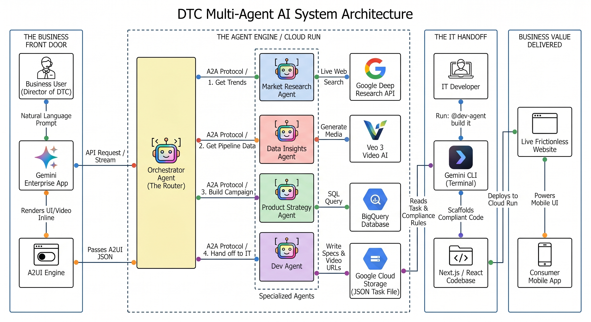

# FSI DTC Revenue Optimizer: Insight-to-Code Multi-Agent Architecture


## 📖 Overview

This repository serves as an enterprise blueprint for a Financial Services (FSI) Direct-to-Consumer (DTC) Multi-Agent AI System. It demonstrates how to leverage Google Cloud's AI ecosystem to move from a raw market hypothesis to a deployed, legally compliant React application in under 10 minutes.

### Powered by Google Cloud Components:
*   **Gemini Enterprise:** Serves as the secure, conversational "Front Door" for business executives.
*   **A2A (Agent-to-Agent) Protocol:** Handles complex routing, delegating tasks and sharing context between the master Orchestrator and specialized sub-agents.
*   **A2UI (Agent-to-UI) Protocol:** Renders rich media components (like generated marketing videos) directly inline within the chat interface.
*   **Gemini Data Analytics API (BigQuery Agent):** Translates natural language into complex SQL joins to audit internal database pipelines.
*   **Google Deep Research API:** Empowers agents to autonomously browse the live web, synthesizing macro-economic trends and competitor analysis.
*   **Veo 3 Video AI:** Dynamically generates high-fidelity campaign media assets based on the AI's strategic recommendations.
*   **Gemini CLI:** Bridges the cloud-based business strategy with the local developer environment to automatically scaffold compliant frontend code.

---

## 💼 The Business Flow

As of 2026, millennial parents face a "perfect storm" of economic pressures—from catastrophic childcare costs to structural housing gridlock. Stretched thin, they desperately seek the peace of mind that life insurance provides but have zero tolerance for digital friction, leading to massive mid-flight application abandonment.

**The Workflow:**
1.  **Market & Demographic Research:** The system autonomously researches current macroeconomic stressors and competitor Insurtech trends.
2.  **Internal Pipeline Audit:** The system interrogates the internal database to pinpoint the exact bottleneck (e.g., the "Medical History" stage) and quantifies the trapped revenue.
3.  **Synthesize & Strategize:** The system drafts a legally compliant "Simplified Issue" re-engagement campaign and generates associated lifestyle video assets.
4.  **The IT Handoff:** The business strategy and media assets are translated into a structured JSON task file. The developer uses the Gemini CLI to read this task and instantly scaffold a frictionless, compliant mobile web application.

### The Use Case Context


---

## 🧠 Agentic Architecture & Technical Flow

This maps the business flow to the secure, Agent Engine/Cloud Run multi-agent system on GCP.



**The Orchestrator Agent (The Router):** Receives the natural language prompt via the Gemini Enterprise App, interprets the request, and coordinates the sequential workflow over the A2A (Agent-to-Agent) Protocol.

*   **Agent 1: Market Research Agent**
    *   **Tech Flow:** Executes long-running, secure calls to the Google Deep Research API.
    *   **Task:** Browses the live web to extract current economic stressors and competitor Insurtech trends for millennial parents.
*   **Agent 2: Data Insights Agent**
    *   **Tech Flow:** Translates natural language into SQL queries against the BigQuery Database.
    *   **Task:** Audits the internal pipeline to identify the exact volume and stage of stalled digital applications.
*   **Agent 3: Product Strategy Agent**
    *   **Tech Flow:** Processes the outputs from Agents 1 & 2. Executes calls to Veo 3 Video AI.
    *   **Task:** Generates the compliant text strategy and returns A2UI JSON payloads to render the generated media inline within the Gemini Enterprise UI.
*   **Agent 4: Dev Agent (The IT Handoff)**
    *   **Tech Flow:** Translates the business strategy and video URLs into a JSON payload.
    *   **Task:** Executes a secure write operation to deposit the JSON Task File directly into Google Cloud Storage.

---

## 📂 Repository Structure

*   `agents/`: Contains the ADK microservices for the multi-agent system.
*   `data/`: BigQuery schema and synthetic application drop-off data generation scripts.
*   `gemini-cli/`: System instructions (`GEMINI.md`) for the developer handoff and code scaffolding.
*   `images/`: Architecture diagrams and presentation assets.

## 🛠️ Getting Started

First, clone the repository to your local machine or CloudTop:


git clone https://github.com/GoogleCloudPlatform/adk-samples.git
cd adk-samples/python/agents/fsi-dtc-revenue-optimizer


## ⚙️ Configuration

**Before deploying**, you must configure the environment for each agent:

1.  **Data Staging (`data/`)**:
    *   Set your `PROJECT_ID` in the `.env` file and run `./setup_bigquery.sh` followed by `python populate_tables.py`.
    *   Register the BigQuery tables in the BigQuery Agents Hub to get your `BQ_DATA_AGENT_ID`.

2.  **Agent Environments (`agents/*/`)**:
    *   Copy `.env.sample` to `.env` in each agent's directory.
    *   Update the `PROJECT_ID` and GCP resource references.
    *   The `market-research` agent requires a valid `GEMINI_API_KEY` to access the Deep Research API.

## 🚀 Deployment Guide

### Part 1: Deploy the Sub-Agents & The orchestrator
Deploy the specialized worker agents to Cloud Run first so their URLs can be passed to the Orchestrator.

```bash
# 1. Deploy Market Research
cd agents/market-research
make deploy

# 2. Deploy Product Strategy
cd ../product-strategy
make deploy

# 3. Deploy Dev Agent
cd ../dev-agent
make deploy

# 4. Deploy Orchestrator
cd ../orchestrator
make deploy

### Part 3: Register in Gemini Enterprise
<details>
<summary><b>Click to expand registration steps</b></summary>

Obtain the Agent Card for each deployed agent by curling its `.well-known/agent-card.json` endpoint:
```bash
curl -s -H "Authorization: Bearer $(gcloud auth print-identity-token)" https://[YOUR-CLOUD-RUN-URL]/.well-known/agent-card.json
```
In the Google Cloud Console, navigate to Gemini Enterprise > Agents.
Click Add Agent > Custom agent via A2A and paste the JSON configurations.
On the User permissions tab, grant All users the Agent User role.

</details>

### Part 4: The Developer Handoff (Act 2)
<details>
<summary><b>Click to expand Gemini CLI instructions</b></summary>

The Business User generates a task via the Dev Agent in the Gemini Enterprise UI. To scaffold the frontend code based on that task:

Navigate to the CLI workspace:
```bash
cd gemini-cli
```
Launch the Gemini CLI and authenticate:
```bash
gemini
```
Claim the task and build the application:
```text
> @dev-agent let me work on TASK-[ID]
> Build and deploy it
```

</details>