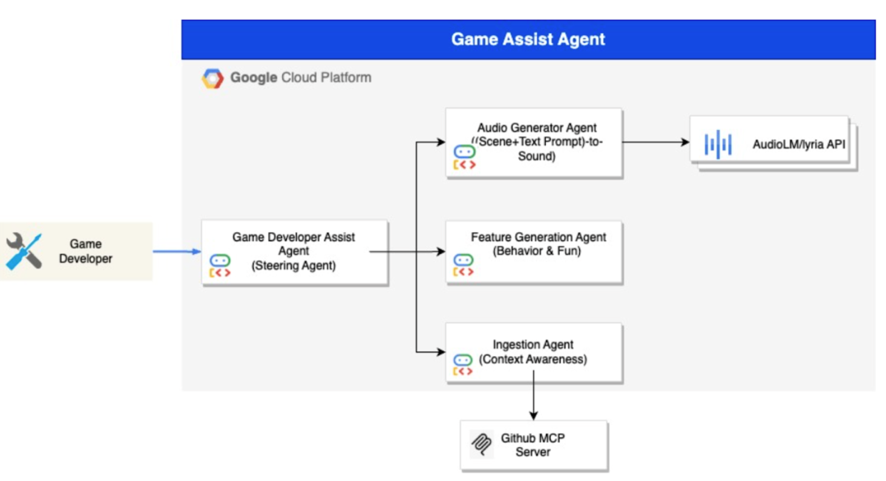
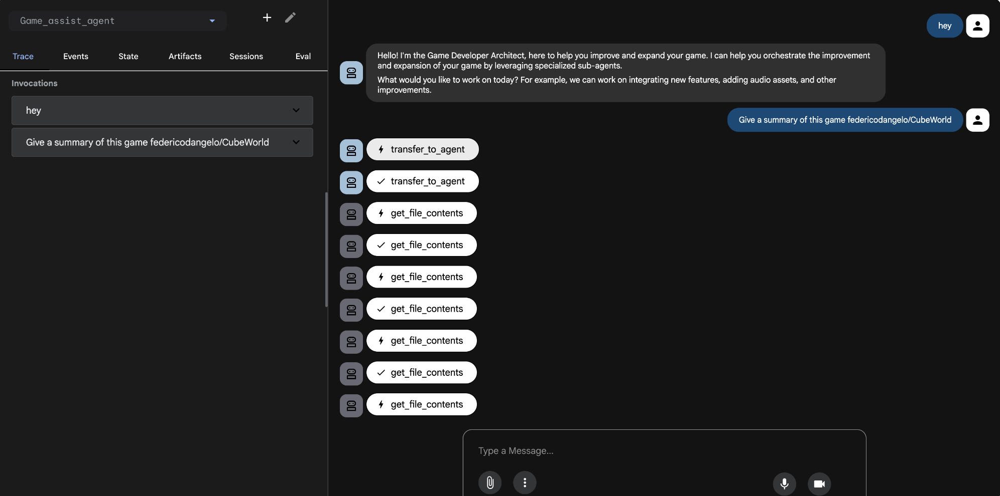
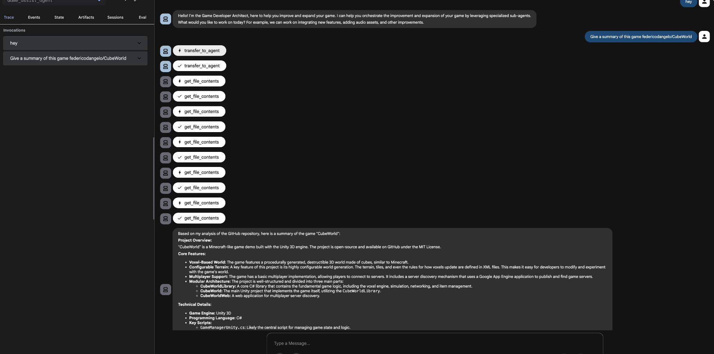
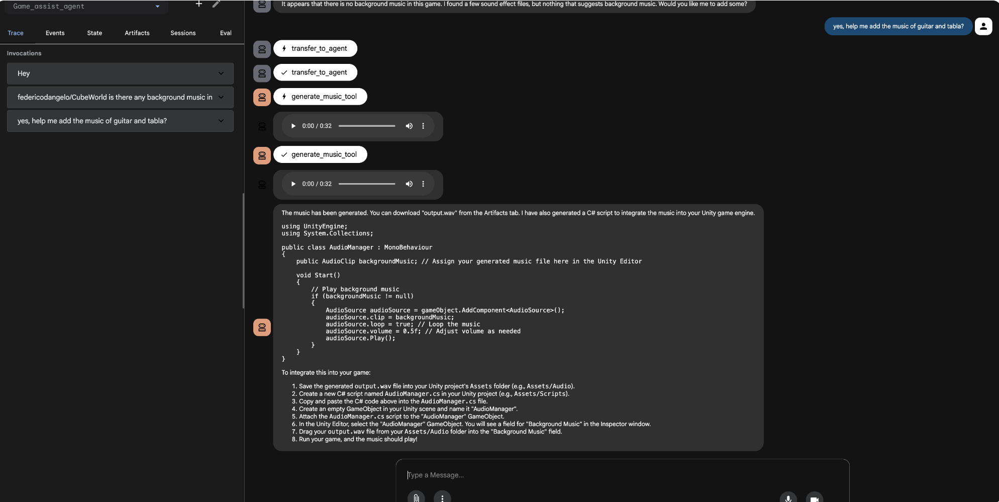

# Game Assist Agent

The Game Assist Agent is an intelligent system designed to assist game developers by automating and augmenting various aspects of the game development lifecycle. It understands your existing game's codebase, generates assets, and helps in designing gameplay logic, acting as a comprehensive AI-powered assistant.

## System Architecture

The architecture is composed of a central steering agent that orchestrates three specialized sub-agents, each responsible for a specific domain of game development.



### 1. Game Developer Assist Agent (Steering Agent)

The Steering Agent serves as the central orchestrator for the system. It manages the primary interaction between the user and the specialized sub-agents.

Its core functions include:

*   **Input Deconstruction**: It analyzes complex user requests and breaks them down into actionable tasks.
*   **Task Delegation**: Based on the required outcome, it routes specific components of the request to the Ingestion Agent, Audio Generator Agent, or Gameplay Logic Module.
*   **Communication Hub**: It facilitates the flow of information across the multi-step pipeline, ensuring that context from repo analysis informs asset generation and logic design.

### 2. Ingestion Agent (Context Awareness)

**Goal**: To "read" and understand the game's source code and structure, much like a human developer. This provides the foundational context for all other agents.

**Components**:

*   **Repo Connector**: Connects to the GitHub API to clone or pull the target game repository, ensuring the agent always has the latest code.
*   **File Parsing Strategy**:
    *   **Scripts (`.cs`)**: Utilizes a code-specialized LLM to generate an Abstract Syntax Tree (AST) or high-level summaries of classes. For example, it can determine that `PlayerController.cs` handles movement and jumping.
    *   **Scene Files (`.unity`)**: As these are YAML files, the agent parses them to understand the scene hierarchy and object composition (e.g., "Scene `Level_1` contains a `Forest` object, a `River` object, and four `Enemy` instances").

### 3. Audio Generator Agent (Audio/Assets)

**Goal**: To handle the creation and management of audio assets.

**Functionality**:

*   This agent is responsible for generating sound effects, background music, and other audio resources based on the context provided by the Ingestion Agent and the user's request.


## Workflow

1.  A developer issues a high-level command to the **Steering Agent** (e.g., "Create a patrol behavior for the enemies in Level_1 and add footstep sounds").
2.  The **Steering Agent** deconstructs the request into sub-tasks.
3.  It tasks the **Ingestion Agent** to analyze the repository to understand the `Enemy` prefab, the `Level_1` scene, and existing movement scripts.
4.  This context is passed to the **Audio Generator Agent** to create appropriate footstep sounds or any music sound.
5.  The generated code and assets are then integrated back into the project, with the Steering Agent overseeing the entire process.
<BR>

## Agent Setup and Installation

### Prerequisites
*   **Python 3.12+:** Ensure you have Python 3.12 or a later version installed.
*   **uv:** Install uv by following the instructions on the official uv website:
    [https://docs.astral.sh/uv/getting-started/installation/](https://docs.astral.sh/uv/getting-started/installation/)
*   **Git:** Ensure you have git installed. If not, you can download it from
    [https://git-scm.com/](https://git-scm.com/) and follow the [installation
    guide](https://git-scm.com/book/en/v2/Getting-Started-Installing-Git).

* **GitHub Personal Access Token** (for private repository ingestion). Otherwise code can work with public github repositories.
* **API Keys**: Gemini 2.5 Pro

### ADK Project Setup with uv

First, you need to install and configure the core ADK agent. After this you'll
set up the data sources to be used with the agent.

1.  **Clone the Repository:**

    ```bash
    git clone https://github.com/google/adk-samples.git
    cd adk-samples/python/agents/game-dev-assistant
    ```

1.  **Install Dependencies with uv:**

    ```bash
    uv sync
    ```

    This command reads the `pyproject.toml` file and installs all the necessary
    dependencies into a virtual environment managed by uv. On the first run,
    this command will also create a new virtual environment.

    By default, the virtual environment will be created in a `.venv` directory
    inside `adk-samples/python/agents/game-dev-assistant`. If you already have a virtual
    environment created, or you want to use a different location, you can use
    the `--active` flag for `uv` commands, and/or change the
    `UV_PROJECT_ENVIRONMENT` environment variable. See
    [How to customize uv's virtual environment location](https://pydevtools.com/handbook/how-to/how-to-customize-uvs-virtual-environment-location/)
    for more details.

1.  **Activate the uv Shell:**

    If you are using the `uv` default virtual environment, you now need
    to activate the environment.

    ```bash
    source .venv/bin/activate
    ```

1.  **Set up Environment Variables:**

    Rename the file ".env.example" to ".env"
    Fill the below values:

    ```bash
    
    GOOGLE_CLOUD_PROJECT='YOUR_VALUE_HERE'

    GOOGLE_CLOUD_LOCATION='YOUR_VALUE_HERE'

    GOOGLE_GENAI_USE_VERTEXAI="True"

    GCS_BUCKET='YOUR_VALUE_HERE'

    #only in case of connection with private github repository
    GITHUB_PERSONAL_ACCESS_TOKEN='YOUR_VALUE_HERE' 

    GOOGLE_API_KEY='YOUR_VALUE_HERE'

    GOOGLE_CLOUD_LOCATION='YOUR_VALUE_HERE'
    ```
### Running the Agent

You can run the agent using the ADK command in your terminal.
from the working directory:

1.  Run agent in CLI:

    ```bash
    uv run adk run game-dev-assistant
    ```

1.  Run agent with ADK Web UI:
    ```bash
    uv run adk web
    ```
    Select the game-dev-assistant from the dropdown

## Sample Input and Output


<br>
<br>


<br>
<br>


<br>
<br>

## Disclaimer

This agent sample is provided for illustrative purposes only and is not intended
for production use. It serves as a basic example of an agent and a foundational
starting point for individuals or teams to develop their own agents.