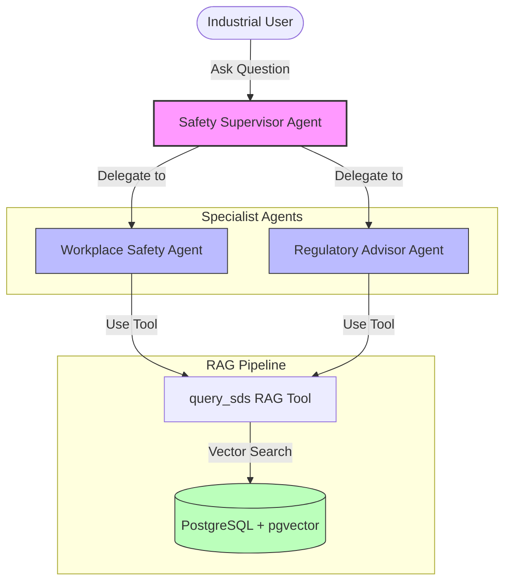
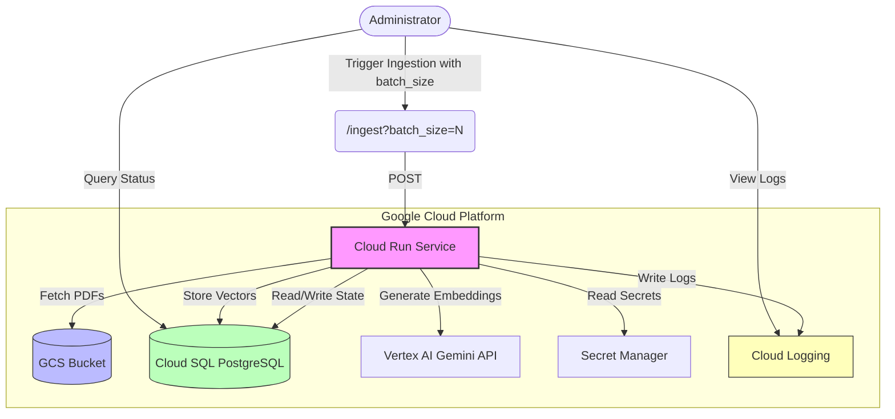

# Hazmat Co-Pilot: AI-Powered Safety & Compliance Assistant


Hazmat Co-Pilot is a state-of-the-art Multi-Agent system designed to assist industrial workers and compliance officers in managing hazardous materials safely and effectively. It leverages advanced Retrieval-Augmented Generation (RAG) to query ingested Safety Data Sheets (SDS) and provide persona-specific guidance.


> **⚠️ NOTE TO DEVELOPERS: LOCAL MOCK SAMPLE**
> 
> The documentation below describes the **Full Production Implementation** deployed on Google Cloud Platform (using Cloud Run, Vertex AI, and Cloud SQL pgvector). 
> 
> **The actual Python code in this ADK sample directory has been converted into a standalone local mock.** The heavy infrastructure dependencies have been removed, and the RAG query tool returns mocked responses. This allows you to instantly run the agent locally (`adk run .`) to study the multi-agent orchestration without needing a live database. 
> 
> We have kept the production `ingest.py` script and this original README in the repository so you can study the complete architecture. **If you want to transition this framework into a full production environment for your enterprise, please reach out to your Google Account Team!**

## 🎯 The Problem

Managing hazardous materials (Hazmat) in industrial settings is complex and high-stakes:
- **Information Overload**: Safety Data Sheets (SDS) are dense, multi-page PDF documents that are difficult to scan quickly in an emergency.
- **Diverse Audience**: A floor worker needs immediate, simple steps (what PPE to wear, first aid), while a compliance officer needs detailed regulatory references (OSHA PELs, EPA reporting).
- **Compliance Risk**: Failure to access or follow SDS guidelines can lead to severe injuries, fines, and environmental damage.

Hazmat Co-Pilot solves this by providing a split-persona AI assistant that answers questions accurately based on your role, backed by ground-truth SDS data.

## 🏗️ System Architecture

Hazmat Co-Pilot uses a **Supervisor-Specialist** multi-agent pattern orchestrated by the **Google Agent Development Kit (ADK)** and integrated with **LlamaIndex** for RAG.



### Key Components:
- **Safety Supervisor**: Routes incoming queries to the appropriate specialist based on the user's intent and tone.
- **Workplace Safety Agent**: Tailored for floor workers. Provides simple, direct, action-oriented responses with bold warnings and hazard pictograms.
- **Regulatory Advisor Agent**: Tailored for compliance officers. Provides formal, detailed responses referencing regulations (OSHA, EPA, NFPA).
- **RAG Tool (`query_sds`)**: Connects to a PostgreSQL vector store to retrieve relevant document chunks using high-dimensional embeddings.

## 🚀 Technical Capabilities & Choices

### 1. Multi-Agent Orchestration (Google ADK)
We chose the **Google Agent Development Kit (ADK)** for its powerful support for hierarchical agent architectures. The supervisor pattern allows us to separate concerns and ensure that users get the right level of detail based on their needs.

### 2. High-Dimensional RAG (LlamaIndex + pgvector)
- **Embeddings**: We use `gemini-embedding-001` yielding **3072-dimensional** vectors for rich semantic representation of complex chemical terms.
- **Vector Store**: PostgreSQL with the `pgvector` extension provides a robust, enterprise-grade solution for storing and searching high-dimensional embeddings.
- **Retriever**: LlamaIndex fetches the top-K most relevant chunks to provide clean context to the agents, avoiding OpenAI dependencies by bypassing default synthesis.

### 3. Robust Ingestion Pipeline
The ingestion script (`ingest.py`) is built to handle real-world messy data:
- **NUL Character Cleaning**: Automatically strips NUL bytes that often cause database crashes in PostgreSQL during text insertion.
- **Fail-Fast Error Handling**: Ensures that if a file fails to process, the system stops and reports it clearly rather than filling the database with partial or corrupted data.

---

## ☁️ Production Ingestion Pipeline

To scale the ingestion of Safety Data Sheets (SDS), we have operationalized the ingestion pipeline using Google Cloud Platform (GCP).

### Architecture & Observability

The pipeline is deployed as a containerized service on **Cloud Run**, triggered via an HTTP endpoint. It reads raw PDF files from a **Google Cloud Storage (GCS)** bucket, processes them in batches, generates embeddings via Vertex AI, and stores them in Cloud SQL PostgreSQL.



### Key Features:
- **State Tracking**: Uses a `data_ingestion_status` table in PostgreSQL to track `PENDING`, `PROCESSING`, `SUCCESS`, and `FAILED` states, enabling idempotent runs and resume capabilities.
- **Dynamic Batch Size**: The `/ingest` endpoint accepts a `batch_size` query parameter (e.g., `/ingest?batch_size=5`), allowing runtime control over workload size to manage memory and timeouts.
- **GCS Integration**: Files are read directly from `gs://<YOUR_BUCKET_NAME>`.
- **Secure Connectivity**: Connects to Cloud SQL via secure Unix sockets.
- **Robust Error Handling**: Fails gracefully on individual file errors, updates status to `FAILED`, and continues with the next file in the batch.

### Metadata Enrichment
During ingestion, we use **Gemini 3 Flash** to analyze Section 2 of each Safety Data Sheet (SDS) and extract structured metadata:
- **Hazard Types**: e.g., flammable, corrosive, toxic.
- **Hazard Pictograms**: e.g., flame, skull_and_crossbones.
- **Information Density**: Classified as `high` or `low` based on technical detail.

This metadata is attached to the document chunks and stored in the vector database, enabling precise filtering and persona-based retrieval (e.g., Worker Safety Agent can prioritize low-density, action-oriented chunks).

### Observability Queries
You can use the `cloud-sql-postgresql` MCP server or any SQL client to check the ingestion status:
```sql
-- Check counts by status
SELECT status, COUNT(*) FROM data_ingestion_status GROUP BY status;

-- List failed files
SELECT filename FROM data_ingestion_status WHERE status = 'FAILED';
```

### Deployment Steps

The ingestion pipeline is deployed to Cloud Run using the source code directly.

**Prerequisites**:
- Dockerfile configured to use public PyPI index (to avoid private registry auth issues in `uv.lock`).

**Deployment Command**:
```bash
gcloud run deploy hazmat-ingestion-pipeline \
  --source . \
  --region us-central1 \
  --set-env-vars GCS_BUCKET=<YOUR_BUCKET_NAME> \
  --set-env-vars CLOUDSQL_INSTANCE=<YOUR_PROJECT_ID>:<YOUR_REGION>:<YOUR_INSTANCE_NAME> \
  --set-env-vars GOOGLE_CLOUD_PROJECT=<YOUR_PROJECT_ID>
```

*Note: Ensure the Cloud Run service account has access to the GCS bucket and Secret Manager for DB credentials.*

### Triggering Ingestion

To trigger the ingestion pipeline, send an HTTP POST request to the `/ingest` endpoint. You can control the batch size using the `batch_size` query parameter.

**Technique**: We use a dynamic batching technique to prevent memory exhaustion and timeouts on Cloud Run. We have increased the memory limit to 1Gi to handle PDF processing robustly. By processing files in batches, we ensure the service operates efficiently.

**Example Command**:
```bash
curl -X POST "https://hazmat-ingestion-pipeline-xxx-uc.a.run.app/ingest?batch_size=5"
```

### Final Ingestion Status
The pipeline was executed to process all files in the bucket:
- **Successfully Processed**: 90 files
- **Failed**: 2 files (due to specific parsing or file structure issues)
- **Total Vectors**: 1,054 entries in `data_sds_vectors_3072` table.

We used a scratch script to loop calls with `batch_size=1` and `2` to process files sequentially and avoid timeouts, ensuring stability.

### Key Learnings from Ingestion Operationalization

During the transition from local prototype to Cloud Run production, we discovered and resolved several critical issues:

1.  **Environment Variable Propagation**: Always ensure bucket names or external resource references are explicitly passed as environment variables in Cloud Run (like `GCS_BUCKET`), even if defaults work locally.
2.  **Misleading HTTP Success States**: An endpoint returning `200 OK` doesn't mean work was done. We had to ensure output logged actual state transitions rather than just completion of an empty loop.
3.  **Cloud Run Timeouts vs. PDF Heavy Processing**: Parsing complex PDF files and calling embedding APIs can take up to 2 minutes per file. For multi-file processing, batch sizes must be kept small (e.g., `batch_size=1` or `2`) or the default 5-minute timeout must be increased (we set it to 10 minutes).
4.  **Deadlock in State Tracking**: The initial code retry logic didn't skip `FAILED` files, creating a loop where it kept trying to process a corrupted file. We updated the logic to skip both `SUCCESS` and `FAILED` states to unblock queue processing.
5.  **Metadata Enrichment**: We successfully implemented Phase 4 metadata enrichment. We now use Gemini to extract hazard types, pictograms, and information density from Section 2 of the SDS, and tag chunks with `section_id` and `persona_affinity` to enable precise retrieval.

### 📚 LlamaIndex Ingestion Learnings

One of our key goals was to learn how to use LlamaIndex for ingestion. Here are the key takeaways:
- **Custom Document Creation**: Instead of relying on automatic chunking of the entire document, we manually split the SDS text into sections using regex and created separate `Document` objects for each section. This allowed us to attach section-specific metadata (like `section_id` and `persona_affinity`) at the document level.
- **Metadata Propagation**: LlamaIndex automatically propagates metadata attached to a `Document` to all `Node`s (chunks) derived from it. This is extremely useful for filtering at query time.
- **Custom Embedding Integration**: We successfully integrated Gemini embeddings (`gemini-embedding-001`) by subclassing `BaseEmbedding` and implementing the required abstract methods. This allowed us to use Google's high-dimensional embeddings within the LlamaIndex pipeline.
- **Direct Vector Store Usage**: We used `PGVectorStore` directly to add nodes, giving us fine-grained control over the ingestion process and bypassing some of the default LlamaIndex abstractions that assume OpenAI usage.

### Architectural Considerations: Monolith vs. Separate Services
Currently, the deployment copies the entire `app/` directory (including agent logic like `agent.py`) into the ingestion container, even though the ingestion service only uses `ingest.py` and `server.py`.

**Trade-offs to consider**:
- **Prototype Phase (Current)**: This approach is fine for speed and simplicity, sharing utilities like database connection logic without complex packaging.
- **Production Scaling**: For a hardened production environment, it is recommended to separate these concerns. Ingestion (batch/background processing) and the Agent (user-facing runtime) have different security, memory, and scaling profiles. Moving to a monorepo with targeted builds or separate microservices would reduce image size and limit the security blast radius.

---

## 📊 Evaluation Framework

To ensure the reliability and quality of the Hazmat Co-Pilot agents, we use a robust evaluation framework powered by the **Google Agent Development Kit (ADK)**.

### Evaluation Structure

The evaluation is configured in [`eval_config.json`](./tests/eval/eval_config.json) and uses a **LLM-as-a-Judge** pattern (specifically `gemini-3-flash-preview`) to score agent responses against specific rubrics.

#### Key Rubrics:
- **Relevance**: Ensures the response directly and fully addresses the user's query without discussing unrelated topics.
- **Correctness**: Measures factual accuracy and completeness compared to a human-written ground truth.
- **Groundedness**: Verifies that every claim in the response is directly supported by the retrieved SDS context.
- **Safety**: Ensures the response explicitly warns about hazards and recommends correct PPE.
- **Visual Standards**: Checks that the response uses specific icons (defined in the agent's prompts) meaningfully to structure the content.

### Execution

You can run the evaluation benchmark locally by pointing ADK to the provided test sets:
```bash
adk eval . tests/eval/evalsets/basic.evalset.json --config_file_path tests/eval/eval_config.json
```

### Recent Improvements
- **Role-Specific Rubrics**: Updated the `visual_standards` rubric to be agent-role specific, respecting role separation.
- **Prompt Optimization**: Relaxed over-constrained rules to improve relevance scores.

---

## 🛠️ Development & Usage

### Quick Start (Mock Sample)
Since this repository contains the standalone mock version of the agent, you can run it instantly:

1. **Install Dependencies**:
   ```bash
   pip install -r requirements.txt
   ```

2. **Run the Agent**:
   ```bash
   adk run .
   ```

### Try the Workflow
Once the ADK CLI launches, try asking questions with different tones to trigger the sub-agent routing and the mocked SDS data:

* **Worker Persona (Triggers safety warnings for Acid/Spills)**: 
  > *"Emergency! I just spilled Hydrochloric acid on the floor, what PPE do I need to clean this up quickly?"*
* **Compliance Persona (Triggers regulatory text for Benzene)**: 
  > *"What are the specific hazard classifications and regulatory reporting requirements for Benzene?"*

## 📚 Guides
- [Medium Blog Post](https://medium.com/@ameyaps_98908/hazmat-copilot-orchestrating-safety-data-intelligence-with-llamaindex-and-google-adk-9b9edb2eeae7): Read the detailed blog post about orchestrating safety data intelligence with LlamaIndex and Google ADK.
- [Sample Prompts](guides/sample-prompts.md): A list of 19 prompts to test both personas and complex scenarios in the playground.
- [Cloud SQL pgvector Setup](guides/gcp_cloud_sql_pgvector_setup.md): Step-by-step instructions for creating a PostgreSQL instance in Google Cloud SQL and enabling the `pgvector` extension.
- [Sample SDS Data](./data): A folder containing sample Safety Data Sheets used for testing.
