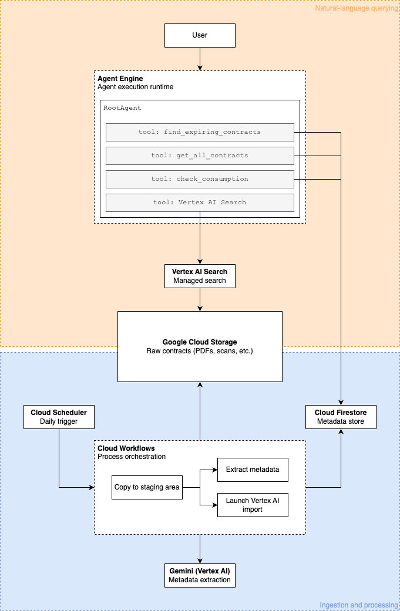

# Procurement Management System

> **Disclaimer:** This project is provided as a Proof of Concept (PoC) / demonstration. It is not intended for production environments as-is. No guarantees or warranties are provided with this code. It must be thoroughly reviewed, tested, and adapted to meet your organization's specific security, compliance, and operational requirements before deployment.

An automated and intelligent AI-powered Procurement Management System built with Python, Google Cloud (Firestore, Vertex AI Search, Cloud Storage), and the [Google Agent Developer Kit (ADK)](https://github.com/google/adk-samples).

## A. Overview & Functionalities

This project consists of two main components:
1. **Processor**: A backend service that manages the ingestion and ETL pipeline. It can poll a Google Drive folder, extract metadata from contracts using Gemini (e.g., provider, termination date, total value), and store metadata in Firestore and the original document in Google Cloud Storage.
2. **Procurement Agent**: A user-facing AI chat agent built with ADK. It leverages a Retrieval-Augmented Generation (RAG) tool powered by Vertex AI Search (working against the ingested contract repository) and a specialized toolkit that queries the Firestore database in real-time.

### Agent Details Table

| Detail | Value |
| :--- | :--- |
| **Interaction Type** | Conversational |
| **Complexity** | Intermediate |
| **Agent Type** | Single Agent |
| **Vertical** | Procurement / Finance |
| **Key Features** | **Vertex AI Search (RAG)**: Answers questions about contract terms and clauses from internal documents.<br>**Firestore Tools**: Real-time querying of contract metadata and spend consumption. |

### Example Interaction

> **User:** *"What contracts are expiring in the next 30 days?"*  
> **Agent:** (Calls `find_expiring_contracts`) *"I found 2 contracts expiring: Google Cloud (ID: gcp-123) and Slack (ID: slack-456)."*  
>
> **User:** *"Check the consumption for the Google Cloud contract."*  
> **Agent:** (Calls `check_consumption`) *"The Google Cloud contract has a commitment of $100,000 and the current spend is $85,000 (85% consumption)."*  
>
> **User:** *"What are the termination notice requirements for Google Cloud?"*  
> **Agent:** (Calls `VertexAiSearchTool`) *"According to the contract, the termination notice requirement is 30 days prior to the expiration date."*

---

## B. Architecture Visuals

### Architecture Diagram

The following diagram illustrates the flow from the user through the core agent, its tools, and the underlying data sources.



---

## C. Setup & Execution

### Prerequisites
* Python 3.10+
* Google Cloud Project with the following APIs enabled:
  * Google Drive API, Cloud Storage API, Firestore API, Vertex AI API.
* The `uv` package manager (for `procurement-agent`).

### Installation & Configuration

1. **Setup the Processor:**
   ```bash
   cd processor
   cp .env.example .env  # Fill in your GCP settings
   python -m venv venv && source venv/bin/activate
   pip install -r requirements.txt
   ```

2. **Setup the Procurement Agent:**
   ```bash
   cd procurement-agent
   cp .env.example .env  # Fill in GCP Project ID and Vertex AI Search path
   uv sync
   ```

### Running the Agent

To run the interactive local playground:
```bash
cd procurement-agent
make playground
```

---

## D. Customization & Extension

* **Modifying the Flow:** Tweak prompts and core logic in `procurement-agent/app/agent.py`.
* **Adding Tools:** Define new tools in `procurement-agent/app/tools.py` and register them in the `Agent` definition in `agent.py`.
* **Changing Data Sources:** Point the RAG component to different Vertex AI Search data stores by updating the `VERTEX_AI_SEARCH_DATA_STORE_ID` in `agent.py`.

---

## E. Evaluation

We use the ADK evaluation framework to ensure agent quality and reliability.

### Methodology
Our evaluation measures two primary metrics:
1. **Tool Trajectory Score:** Ensures the agent calls the correct tools in the expected sequence.
2. **Response Quality:** Uses a `rubric_based_final_response_quality_v1` (LLM-as-a-judge) to evaluate relevance and helpfulness.

### Running Evaluations
Evaluation scripts and configurations are located in `procurement-agent/tests/eval/`.

```bash
cd procurement-agent
make eval      # Runs the basic evalset
make eval-all  # Runs all available evalsets
```

Refer to `procurement-agent/tests/eval/evalsets/README.md` for more details on creating custom evaluation cases.

---

## Repository Structure

```
procurement-agent/
├── infra/                # Infrastructure as Code (Terraform) and Workflows
├── processor/            # The ETL and notification pipeline
│   ├── process.py        # Main CLI script
│   └── ...
└── procurement-agent/    # The ADK-based LLM conversational agent
    ├── app/
    │   ├── agent.py      # ADK LLM Agent definition
    │   ├── tools.py      # Custom tools (Firestore, Spend, etc.)
    │   └── ...
    ├── tests/eval/       # Evaluation sets and configuration
    ├── Makefile          # Useful commands (test, lint, eval, playground)
    └── ...
```
