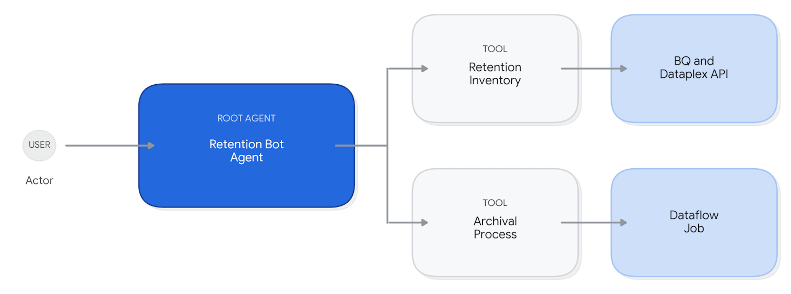

# Retention Bot

The **RetentionBot** is a specialized data governance agent designed for Dataplex. Its primary function is to identify BigQuery datasets that have exceeded their retention periods and facilitate their archival or deletion through automated workflows.

---

## Overview

Managing stale data is critical for cost optimization and compliance. This agent provides a conversational interface to:
* **Identify** datasets older than a specified retention period (defaulting to 30 days).
* **Analyze** dataset usage by querying `INFORMATION_SCHEMA` for the last access timestamp.
* **Remediate** by triggering Google Dataflow Flex Templates to archive data from BigQuery to Google Cloud Storage (GCS).

---

## Features

* **Autonomous Discovery**: Scans for datasets across a project or an entire Google Cloud Organization.
* **Interactive Governance**: Presents findings in a Markdown table and requests user confirmation before executing archival jobs.
* **Flexible Archival**: Supports toggling the deletion of source BigQuery data after a successful archival to GCS.
* **Contextual Memory**: Built on the Google ADK, it utilizes session memory to track archival requests and job statuses.

---

## Agent Architecture Flow



---

## Getting Started

### Prerequisites
* Python 3.10 to 3.12.
* A Google Cloud Project with BigQuery, Dataplex, and Dataflow APIs enabled.
* A Dataflow Flex Template for BigQuery to GCS archival.

### Installation
1.  **Clone the repository**:
    ```bash
    git clone [https://github.com/google/adk-samples.git](https://github.com/google/adk-samples.git)
    cd adk-samples/python/agents/bq-retention-agent
    ```
2.  **Install dependencies**:
    ```bash
    pip install .
    OR
    python -m pip install .
    ```

### Configuration
Create a `.env` file in the root directory and populate it with your environment-specific parameters:

```env
# Google Cloud Configurations
GOOGLE_GENAI_USE_VERTEXAI=TRUE
GOOGLE_CLOUD_PROJECT="<YOUR_PROJECT_ID>"
GOOGLE_CLOUD_LOCATION="<YOUR_REGION>"

# Dataflow Configurations
JOB_NAME_PREFIX="<YOUR_JOB_PREFIX>"
DATAFLOW_TEMP_BUCKET="<YOUR_TEMP_BUCKET_NAME>"
TEMPLATE_GCS_PATH="gs://<YOUR_TEMPLATE_PATH>"
DATAFLOW_SERVICE_ACCOUNT="<YOUR_SERVICE_ACCOUNT_EMAIL>"
NETWORK="<YOUR_NETWORK_NAME>"
SUB_NETWORK="<YOUR_SUBNET_PATH>"

# Model Configurations
GEMINI_MODEL_FLASH="<YOUR_MODEL_VERSION>"

# BQ Retention Configurations
ORGANIZATION_ID="<YOUR_ORG_ID>"
PROJECT_ID="<YOUR_PROJECT_ID>"
LOCATION="<YOUR_REGION>"
DEFAULT_RETENTION_DAYS=30
BQ_EXECUTION_PROJECT_ID="<YOUR_PROJECT_ID>"
ARCHIVE_BUCKET_ASSET_NAME="<YOUR_ASSET_RESOURCE_PATH>"
```

## Usage

The agent is built using the Google ADK and can be interacted with via the ADK web interface or CLI.

1.  **Launch the Agent**:
    ```bash
    adk web
    ```
    (Note: This requires the environment variables from the `.env` file to be loaded.)
2.  **Conversational Workflow**:
    * **Identification**: The agent analyzes datasets based on a specific retention period provided by the user or a default of 30 days.
    * **Summarization**: Findings are presented in a Markdown table, including metadata and last access timestamps.
    * **Confirmation**: The agent asks for confirmation before archiving specific datasets and checks if source data should be deleted.
    * **Execution**: Upon approval, the agent triggers Dataflow jobs and provides links for real-time monitoring.

---

## Example Instructions

You can interact with RetentionBot using the following types of queries:
* **"List table out of retention period."**
* **"Find datasets that haven't been accessed in 90 days."**
* **"Show me stale datasets and archive them if they are older than 3 months."**
* **"Archive the identified datasets and delete the original source data."**

---

## Project Structure

The project consists of the following core components:
* **`agent.py`**: The entry point that initializes the `Agent` with the Gemini model and registers the `get_retention_datasets` and `archive_datasets` tools.
* **`prompt.py`**: Defines the `AGENT_INSTRUCTION`, detailing the persona of "RetentionBot" and the multi-step governance workflow.
* **`dataplex_retention.py`**: Contains the `DataplexRetentionAgent` class, which handles project discovery and queries BigQuery `INFORMATION_SCHEMA` to find last access timestamps.
* **`dataplex_archive.py`**: Contains the `DataflowFlexTemplateLauncher` class, which manages authentication and issues POST requests to the Dataflow API to launch archival jobs.
* **`pyproject.toml`**: Manages project metadata, authors (Imran Khan), and package dependencies like `google-adk` and `google-cloud-dataplex`.
