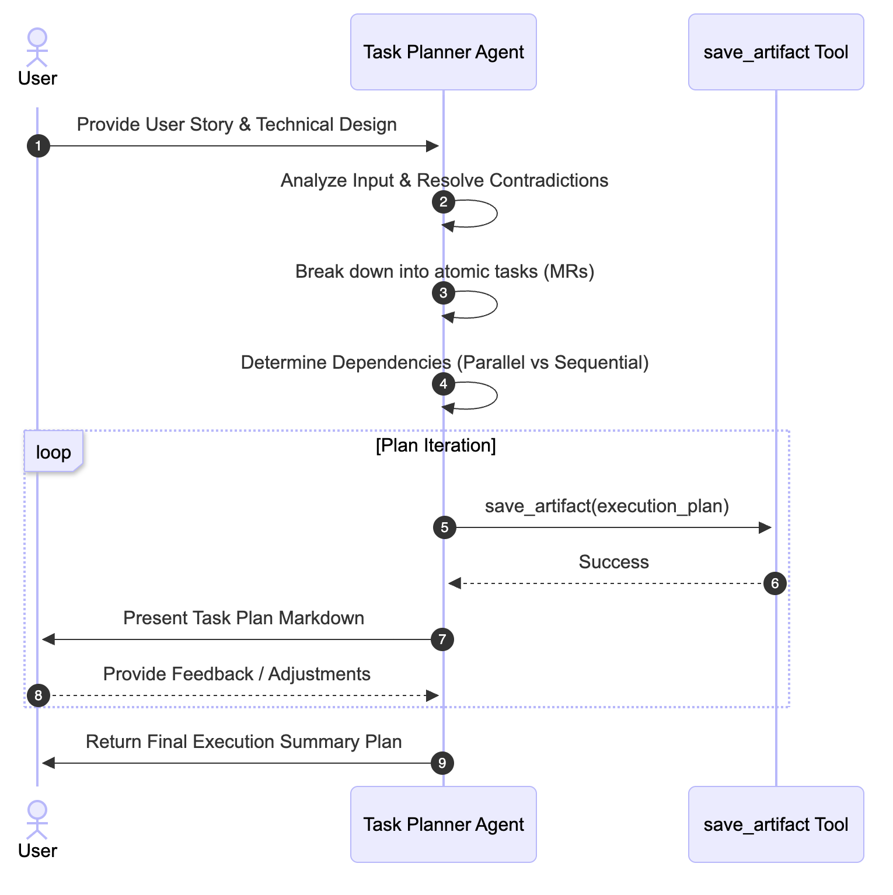

# Task Planner

## A. Overview & Functionalities

This agent is intended to be used as part of a broader Software Development Life Cycle (SDLC) workflow. For more details on how it integrates with other agents, please see the [SDLC Agents Workflow](sdlc_agents_workflow.md):


### Agent Details Table
| Interaction Type | Workflow / Conversational |
| :--- | :--- |
| **Complexity** | Easy |
| **Agent Type** | Single Agent |
| **Vertical** | DevOps / Software Engineering |
| **Key Features** | Atomic task breakdown, Merge Request / Pull Request scoping, Git dependency and branch chaining, outputs a structured Execution Plan Markdown table with file-level specifications. |

## B. Architecture



### Example Interaction
**User:** Here is the user story and technical design for the Slack notification integration:
[User Story and Technical Design omitted for brevity...]
Please break this down into actionable development tasks and give me an execution plan.

**Agent:** I have analyzed the technical design and user story. I've created the following execution plan to implement the Slack integration systematically:

# Execution Plan: Slack Integration for Critical System Alerts

**Primary Goal**: Implement workspace-level Slack OAuth and extend the Notification Service to dispatch critical alerts to Slack channels.

## Comprehensive Task Table

| Task ID | Title | Technical Description & Files | Acceptance Criteria & Testing | Dependencies & Blockers | Source Branch | Target Branch | Estimated Effort |
|---|---|---|---|---|---|---|---|
| **1** | **Slack OAuth Credential Store** | **Description:** Create DB migrations and repository for workspace-level Slack OAuth tokens.<br><br>**Files:** `migrations/V10__slack_tokens.sql`, `src/db/slack_repo.py` | **AC:** Tokens can be securely saved, retrieved, and deleted.<br><br>**Testing:** Unit tests for repository. | **Requires:** None<br><br>**Required By:** 2, 3 | `main` | `feature/slack-oauth-store` | Medium |
| **2** | **Slack OAuth API Flow** | **Description:** Implement the OAuth callback endpoints to exchange temporary codes for permanent tokens.<br><br>**Files:** `src/api/slack_oauth_router.py` | **AC:** Successful OAuth flow redirects correctly and saves token.<br><br>**Testing:** Integration tests with mock Slack API. | **Requires:** 1<br><br>**Required By:** None | `feature/slack-oauth-store` | `feature/slack-oauth-api` | Medium |
| **3** | **Notification Service Slack Extension** | **Description:** Extend `NotificationService` to implement a `SlackDispatcher` using saved tokens.<br><br>**Files:** `src/notifications/slack_dispatcher.py`, `src/notifications/service.py` | **AC:** Alerts with severity 'CRITICAL' trigger a Slack message.<br><br>**Testing:** Unit tests mocking Slack API client. | **Requires:** 1<br><br>**Required By:** None | `main` | `feature/slack-dispatcher` | Large |

[...]

## C. Setup & Execution

### Prerequisites & Installation

*   Python 3.10+
*   uv
    *   For dependency management and packaging. Please follow the instructions on the official [uv website](https://docs.astral.sh/uv/) for installation.

    ```bash
    curl -LsSf https://astral.sh/uv/install.sh | sh
    ```

Set up your environment variables by copying the example file:
```bash
cp .env.example .env
```

Install dependencies:
```bash
uv sync --dev
```

### Running the Agent
Run the agent locally:
```bash
uv run adk web sdlc_task_planner
```

### Alternative: Using Google Agents CLI

You can also use the [Google Agents CLI](https://github.com/google/agents-cli) to create a production-ready version of this agent with additional deployment options.

**Install the CLI** (one-time):

```bash
uvx google-agents-cli setup
```

**Create the project from this sample** (replace `my-task-planner` with your project name):

```bash
agents-cli create my-task-planner -a adk@sdlc-task-planner
```

The Google Agents CLI will prompt you to select deployment options and provides additional production-ready features including automated CI/CD deployment scripts.

## D. Customization & Extension

- **Modifying the Flow:** Adjust task sizing rules (e.g., max lines of code per PR), branch naming conventions, or the Execution Plan format in `sdlc_task_planner/prompt.py`.
- **Adding Tools:** Integrate direct API hooks for GitHub, Bitbucket, or GitLab in `sdlc_task_planner/tools/` to automate the creation of tickets and branches.
