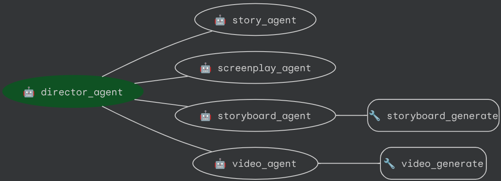

# Short Movie Agents
ADK version: 1.31.1, Owner: @rsamborski

Short Movie Agents demo is an ADK example showcasing a multi-agent architecture to construct end to end videos based on the user's intent. It includes agents which have a different role each:

- [director agent](app/agent.py) - main coordinator
- [story agent](app/story_agent.py) - creates the story
- [screenplay agent](app/screenplay_agent.py) - generates screenplay based on the story
- [storyboard agent](app/storyboard_agent.py) - uses context from previous agents and Imagen4 model to generate storyboards
- [video agent](app/video_agent.py) - produces final video using Veo3

Diagram:



## Changelog

See [Changelog.md](Changelog.md).

## Project Structure

This project is organized as follows:

```
short-movie-agents/
├── app/                 # Core application code
│   ├── agent.py         # Main agent logic
│   ├── server.py        # FastAPI Backend server
│   └── utils/           # Utility functions and helpers
├── Makefile             # Makefile for common commands
├── GEMINI.md            # AI-assisted development guide
└── pyproject.toml       # Project dependencies and configuration
```

## Requirements

Before you begin, ensure you have:

- **Python**: 3.13+
- **uv**: Python package manager (used for all dependency management in this project) - [Install](https://docs.astral.sh/uv/getting-started/installation/) ([add packages](https://docs.astral.sh/uv/concepts/dependencies/) with `uv add <package>`)
- **Google Cloud SDK**: For GCP services - [Install](https://cloud.google.com/sdk/docs/install)
- **make**: Build automation tool - [Install](https://www.gnu.org/software/make/) (pre-installed on most Unix-based systems)

## Getting started

### Google Agents CLI (recommended)

Use the [Google Agents CLI](https://github.com/google/agents-cli) to scaffold a production-ready project and choose your deployment target ([Agent Runtime](https://docs.cloud.google.com/gemini-enterprise-agent-platform/build/runtime) or [Cloud Run](https://cloud.google.com/run)), with CI/CD and other production features.

**Install the CLI** (one-time):

```bash
uvx google-agents-cli setup
```

**Create the project from this sample** (replace `my-short-movie-agents` with your project name):

```bash
agents-cli create my-short-movie-agents -a adk@short-movie-agents
```

The Google Agents CLI will prompt you to select deployment options and set up your Google Cloud project.

From your newly created project directory (e.g. `my-short-movie-agents`), run:

```bash
cd my-short-movie-agents
uv sync --dev
uv run adk run app
```

For the web UI:

```bash
uv run adk web
```

Then select **app** from the dropdown menu.

<details>
<summary>Alternative: Clone this repository and run the sample locally</summary>

### Run from this repository

Use this path to run the **adk-samples** checkout of Short Movie Agents without scaffolding a new project.

1. **Clone and enter the sample directory:**

   ```bash
   git clone https://github.com/google/adk-samples.git
   cd adk-samples/python/agents/short-movie-agents
   ```

   Stay in `python/agents/short-movie-agents` for the steps below.

2. **Install dependencies:**

   ```bash
   uv sync --dev
   ```

   Or use `make install` (equivalent).

3. **Configure environment:**

   ```bash
   cp .env-template .env
   # Uncomment and update the environment variables for your project
   ```

   You can also export variables in your shell, for example:

   ```bash
   export GOOGLE_CLOUD_PROJECT=my-project
   export GOOGLE_CLOUD_LOCATION=my-region
   # Optional: for Vertex AI
   export GOOGLE_GENAI_USE_VERTEXAI=1
   ```

4. **Run the agent**

   - **ADK web UI:** Either run `make playground` or:

     ```bash
     source .env
     uv run adk web . --port 8501 --reload_agents
     ```

     When prompted, select the **app** folder.

   - **ADK CLI:**

     ```bash
     source .env
     uv run adk run app
     ```

### Development (from this repository)

```bash
uv sync --dev
uv run pytest
```

### Storage Bucket

Note that the agent uses a bucket for storing generated storyboards and videos. You can create a bucket by running:

```
gcloud storage buckets create gs://YOUR_BUCKET_NAME --project=PROJECT_ID --location=LOCATION
```

Make sure the account running the agent has read/write permissions to that bucket by running:

```
gcloud storage buckets add-iam-policy-binding gs://YOUR_BUCKET_NAME \
    --member="serviceAccount:service-PROJECT_NUMBER@gcp-sa-aiplatform.iam.gserviceaccount.com" \
    --role="roles/storage.objectAdmin"
```

</details>

## Commands

| Command              | Description                                                                                 |
| -------------------- | ------------------------------------------------------------------------------------------- |
| `make install`       | Install all required dependencies using uv                                                  |
| `make playground`    | Launch the ADK web UI (`adk web` with reload); select the **app** folder when prompted. |
| `make backend`       | Deploy agent to Cloud Run |
| `make local-backend` | Launch local development server |
| `make test`          | Run unit and integration tests                                                              |
| `make lint`          | Run code quality checks (codespell, ruff, mypy)                                             |
| `uv run jupyter lab` | Launch Jupyter notebook                                                                     |

For full command options and usage, refer to the [Makefile](Makefile).


## Usage

This sample follows a "bring your own agent" style: you implement behavior under `app/`, while a project scaffolded with the [Google Agents CLI](#google-agents-cli-recommended) can supply UI, infrastructure, deployment, and monitoring around that agent.

1. **Integrate:** Update the agent by editing files in the `app` folder.
2. **Test:** Explore the agent in the ADK web UI (for example `make playground` from this repo). The UI supports chat history, feedback, and reloads when you change code.
3. **Deploy:** Use the [Google Agents CLI](#google-agents-cli-recommended) flow under [Getting started](#getting-started) to pick a deployment target (Agent Runtime or Cloud Run) and CI/CD. If you use a checkout of this repository, you can deploy with `make backend` (see [Commands](#commands)).
4. **Monitor:** Track performance with Cloud Logging, Tracing, and the Looker Studio dashboard (see [Monitoring and Observability](#monitoring-and-observability)).

The project includes a `GEMINI.md` file that provides context for AI tools like Gemini CLI when asking questions about the project.

## Monitoring and Observability

You can use [this Looker Studio dashboard](https://lookerstudio.google.com/reporting/46b35167-b38b-4e44-bd37-701ef4307418/page/tEnnC) template to visualize events logged in BigQuery. See the "Setup Instructions" tab to get started.

The application uses OpenTelemetry for observability: events go to Google Cloud Trace and Logging, and to BigQuery for longer-term analysis.

## Disclaimer

This list is not an official Google product. Links on this list also are not necessarily to official Google products.

Initial agent structure was generated with [[`google/agents-cli`](https://github.com/google/agents-cli)](https://github.com/google/agents-cli) version `0.15.4`.