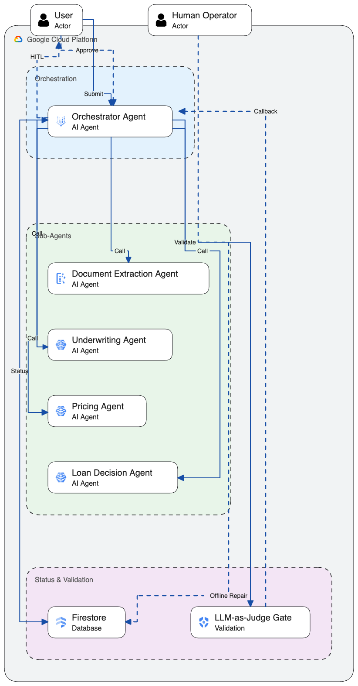
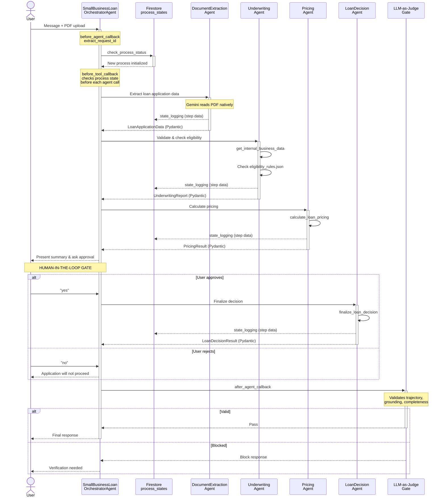
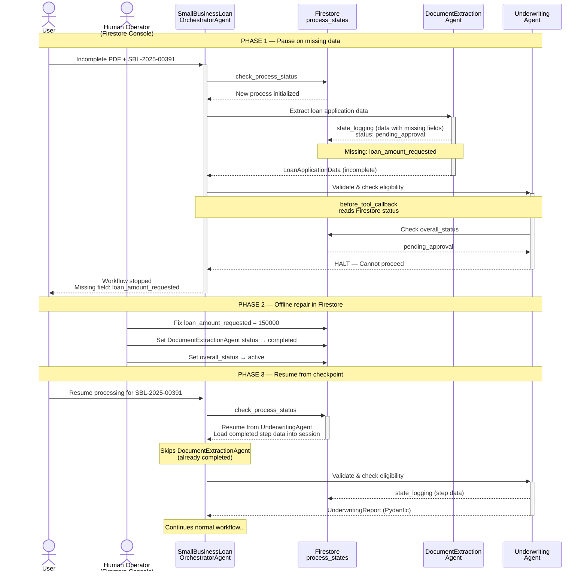

# Small Business Loan Agent

A multi-agent system built with the [Google Agent Development Kit (ADK)](https://google.github.io/adk-docs/) that automates small business loan processing for Cymbal Bank. It demonstrates sequential multi-agent orchestration, human-in-the-loop approval, LLM-as-Judge validation, and Firestore-backed repair & resume.

## A. Overview & Functionalities

### Agent Details

| Property             | Value                                       |
| -------------------- | ------------------------------------------- |
| **Interaction Type** | Workflow                                    |
| **Complexity**       | Advanced                                    |
| **Agent Type**       | Multi-Agent (1 orchestrator + 4 sub-agents) |
| **Vertical**         | Financial Services                          |
| **Framework**        | ADK                                         |
| **Model**            | Gemini 3.1 Pro Preview                      |

### Key Features

| Feature                            | Description                                                                                             |
| ---------------------------------- | ------------------------------------------------------------------------------------------------------- |
| **Multi-Agent Orchestration**      | Orchestrator coordinates 4 specialized sub-agents via `AgentTool` in a sequential workflow              |
| **Multimodal Document Extraction** | Gemini 3.1 Pro Preview reads loan application PDFs natively                                             |
| **Structured Output**              | Each sub-agent returns validated Pydantic models via `output_schema` / `output_key`                     |
| **Human-in-the-Loop (HITL)**       | Orchestrator pauses after pricing to present results and wait for explicit user approval                |
| **LLM-as-Judge Gate**              | After-agent callback validates trajectory correctness and data grounding before showing responses       |
| **Repair & Resume**                | Firestore workflow management tracks each step; workflow can pause on errors and resume from checkpoint |
| **Before/After Callbacks**         | State checks before each sub-agent; state logging and issue detection after each sub-agent              |
| **Before-Tool Callback**           | Process halt check prevents agents from executing when workflow is in error/pending state               |

### Example Interaction

**Complete loan application example** (using `data/sample_application_complete.pdf`):

```
User: Process this loan application for SBL-2025-00142
      [uploads sample_application_complete.pdf]

Agent: [Calls check_process_status -> initializes new process]
       [Calls DocumentExtractionAgent -> extracts data from PDF]
       [Calls UnderwritingAgent -> validates against internal records, checks eligibility]
       [Calls PricingAgent -> calculates rate based on risk tier]

       Loan Application Summary:
       - Business: Cymbal Coffee Roasters LLC
       - Owner: Jane Doe
       - Loan Amount: $150,000
       - Annual Revenue: $850,000
       - Eligibility: ELIGIBLE
       - Risk Tier: Tier 1 - Low Risk
       - Interest Rate: 6.50%
       - Monthly Payment: $2,940.97
       - Total Interest: $26,458.20

       Do you approve this loan? (yes/no)

User: yes

Agent: [Calls LoanDecisionAgent -> finalizes decision]

       Loan SBL-2025-00142 has been approved.
       Decision letter DL-2025-00142-001 has been generated.
```

**Pause, Repair & Resume example** (using `data/sample_application_incomplete.pdf` which has missing fields):

A. submit the incomplete application

```
User: Process this application for SBL-2025-00391
      [uploads sample_application_incomplete.pdf]

Agent: [check_process_status -> initializes new process]
       [DocumentExtractionAgent -> extracts data, detects missing fields]
       [UnderwritingAgent -> before_tool_callback halts execution]

       I encountered an error while processing your application.
       Cannot proceed to UnderwritingAgent: Pending approval
       - Missing 1 critical field(s): loan_amount_requested

       Please provide a complete document or update the application
       with the required field before we can proceed.
       The workflow has been stopped.

       Reference: SBL-2025-00391
```

B. Repair the data in Firestore:

1. Open the [Firestore Console](https://console.cloud.google.com/firestore) and select the `session-states` database
2. Navigate to **`process_states`** collection → document **`SBL-2025-00391`**
3. Under `steps.DocumentExtractionAgent.data`, fill in the missing field:

- Set `loan_amount_requested` to the correct value (e.g., `150000`)

4. Update `steps.DocumentExtractionAgent.status` from `pending_approval` → `completed`
5. Update the root `overall_status` from `pending_approval` → `active`

C. Resume the workflow

```
User: Resume processing for SBL-2025-00391

Agent: [check_process_status -> detects DocumentExtractionAgent completed]
       [Skips DocumentExtractionAgent, resumes from UnderwritingAgent]
       [UnderwritingAgent -> validates against internal records, checks eligibility]
       [PricingAgent -> calculates rate based on risk tier]
       ...continues normal workflow...
```

## B. Architecture Visuals



**Complete loan application**



**Pause, Repair & Resume:**



**State Management (Firestore):**

```
Process State (per loan_request_id)
  |-- overall_status: active | pending_approval | completed | failed
  |-- steps:
  |     |-- DocumentExtractionAgent: { status, data, completed_at }
  |     |-- UnderwritingAgent:       { status, data, completed_at }
  |     |-- PricingAgent:            { status, data, completed_at }
  |     |-- LoanDecisionAgent:       { status, data, completed_at }
  |-- issues: [ { step, description, resolved } ]
```

## C. Setup & Execution

### Prerequisites

- Python 3.11+
- uv
  - For dependency management and packaging. Please follow the
    instructions on the official
    [uv website](https://docs.astral.sh/uv/) for installation.

  ```bash
  curl -LsSf https://astral.sh/uv/install.sh | sh
  ```

- Google Cloud project with Vertex AI API and Firestore enabled
- `gcloud` CLI authenticated

### Google Cloud Setup

```bash
# Set your project
export PROJECT_ID=your-project-id
gcloud config set project $PROJECT_ID

# Enable required APIs
gcloud services enable \
  aiplatform.googleapis.com \
  firestore.googleapis.com

# Create Firestore database for state management
gcloud firestore databases create \
  --database=session-states \
  --location=nam5 \
  --type=firestore-native

```

### Installation

```bash
# Clone the repository
git clone <repo-url>
cd python/agents/small-business-loan-agent

# Install dependencies
uv sync

# Configure environment
cp .env.example .env
# Edit .env with your GCP project details
```

### Environment Variables

```bash
# Required
GOOGLE_GENAI_USE_VERTEXAI=TRUE
GOOGLE_CLOUD_PROJECT=your-project-id
GOOGLE_CLOUD_LOCATION=global

# Firestore
GCP_FIRESTORE_DB=session-states

```

### Sample Documents

Generate the sample loan application PDFs before running the agent:

```bash
uv run python data/generate_sample_applications.py
```

This creates two PDFs in `data/sample_applications/`:

- `sample_application_complete.pdf` -- Happy path (all fields present, strong financials)
- `sample_application_incomplete.pdf` -- Same application with missing fields (triggers repair & resume)

Both represent the same fictional business (Cymbal Coffee Roasters LLC / Jane Doe). The incomplete version is missing the loan amount requested to demonstrate the pause, repair & resume flow.

### Running the Agent

```bash
# Run with ADK web UI
uv run adk web
```

Then open `http://localhost:8000`, select `small_business_loan_agent`, upload a sample PDF, and send:

```
Process this loan application for SBL-2025-00142
```

## D. Customization & Extension

### Modifying the Flow

- **Prompts:** Each sub-agent has a `prompt.py` in its directory. Modify these to change agent behavior.
- **Orchestrator flow:** Edit `prompt.py` to change the step sequence, add/remove agents, or alter the HITL approval point.
- **Eligibility rules:** Edit `sub_agents/underwriting/eligibility_rules.json` to add or modify business lending criteria.

### Adding Sub-Agents

1. Create a new directory under `sub_agents/` with `agent.py`, `models.py`, `prompt.py`, and optionally `tools.py`
2. Add the agent to the orchestrator's tools list in `agent.py` as an `AgentTool`
3. Update `state_service.py` ALL_STEPS list and `state_callbacks.py` AGENT_OUTPUT_KEY_MAP
4. Update the orchestrator prompt to include the new step

### Connecting Real Data Sources

The mock tools in each sub-agent's `tools.py` are designed to be replaced:

- **`get_internal_business_data`** (underwriting) -- Replace `MOCK_INTERNAL_RECORDS` with calls to your bank's internal API, database, or CRM
- **`calculate_loan_pricing`** (pricing) -- Replace `_determine_risk_tier` with calls to your pricing engine or rate sheet API
- **`finalize_loan_decision`** (loan_decision) -- Replace with calls to your loan origination system

### Changing the Document Type

The `DocumentExtractionAgent` uses Gemini's native multimodal capabilities to read PDFs. To process a different document type:

1. Update `sub_agents/document_extraction/models.py` with new Pydantic fields
2. Update `sub_agents/document_extraction/prompt.py` to describe the new document structure
3. Generate new sample documents in `data/`

### Adding Document AI for Production Extraction

For high-volume production workloads requiring precise, consistent extraction with confidence scores and bounding boxes, you can integrate [Google Document AI](https://cloud.google.com/document-ai) alongside or instead of Gemini's native PDF reading:

1. Create a Document AI custom extractor processor configured for your document type
2. Add a `before_agent_callback` or tool to the `DocumentExtractionAgent` that calls the Document AI API to extract entities from the uploaded PDF
3. Pass the extracted entities to the agent prompt for structured mapping into the Pydantic model
4. Add `google-cloud-documentai` to your dependencies

## E. Tests

For running tests and evaluation, install the extra dependencies:

```bash
uv sync --dev
```

Then run tests from the `small-business-loan-agent` directory:

```bash
# Unit tests (no GCP required)
uv run pytest tests/unit

# Integration tests (requires GCP credentials and takes 1 to 2 min to run)
uv run pytest tests/integration
```

## F. Evaluation

The agent includes an ADK evaluation notebook with 3 test cases covering:

| Test Case                            | Description                                 | Turns |
| ------------------------------------ | ------------------------------------------- | ----- |
| `happy_path_with_approval`           | Full end-to-end flow with user approval     | 2     |
| `stop_for_reparation_missing_fields` | Incomplete application triggers repair      | 1     |
| `resume_after_repair`                | Resume from checkpoint after offline repair | 1     |

**Run the evaluation notebook:**

Install dev dependencies and register the Jupyter kernel:

```bash
uv sync --dev
uv run python -m ipykernel install --user --name small-business-loan-agent
```

Then open `eval/small_business_loan_agent_eval.ipynb` to generate the eval set and run evaluations interactively. If the kernel is not automatically detected or visible, reload window of your IDE

**Evaluation criteria:**

| Criterion                                | Purpose                                     | Reference Required |
| ---------------------------------------- | ------------------------------------------- | ------------------ |
| `rubric_based_tool_use_quality_v1`       | Validates tool call ordering (LLM judge)    | No                 |
| `rubric_based_final_response_quality_v1` | Evaluates response completeness and clarity | No                 |
| `final_response_match_v2`                | Semantic equivalence to expected response   | Yes                |

See [ADK Evaluation docs](https://google.github.io/adk-docs/evaluate/) for more details.

## G. Deploy

Use the [Agent Starter Pack](https://goo.gle/agent-starter-pack) to create a production-ready version of this agent with deployment options. Run this command from the root of the `adk-samples` repository:

```bash
uvx agent-starter-pack create my-loan-agent -a local@python/agents/small-business-loan-agent
```

<details>
<summary>Alternative: Using pip</summary>

```bash
python -m venv .venv && source .venv/bin/activate # On Windows: .venv\Scripts\activate
pip install --upgrade agent-starter-pack
agent-starter-pack create my-loan-agent -a local@python/agents/small-business-loan-agent
```

</details>

The starter pack will prompt you to select deployment options and provides additional production-ready features including automated CI/CD deployment scripts.

When deploying to Agent Engine, pass the required environment variables using `--set-env-vars` directly via the deploy script (the Makefile does not forward this flag):

```bash
cd my-loan-agent && \
uv export --no-hashes --no-header --no-dev --no-emit-project --no-annotate > small_business_loan_agent/app_utils/.requirements.txt && \
uv run -m small_business_loan_agent.app_utils.deploy \
    --source-packages=./small_business_loan_agent \
    --entrypoint-module=small_business_loan_agent.agent_engine_app \
    --entrypoint-object=agent_engine \
    --requirements-file=small_business_loan_agent/app_utils/.requirements.txt \
    --set-env-vars="GCP_FIRESTORE_DB=session-states,GOOGLE_CLOUD_LOCATION=global"
```

> **Note:** `GOOGLE_CLOUD_LOCATION=global` is required because the Gemini preview model used by this agent is only available in the `global` region, while Agent Engine deploys to a specific region (e.g., `us-central1`). The starter pack preserves this value for model calls.

The service account running the agent must have access to Firestore. For example, if deploying on Agent Engine:

```bash
export PROJECT_ID=your-project-id
export PROJECT_NUMBER=$(gcloud projects describe $PROJECT_ID --format='value(projectNumber)')

gcloud projects add-iam-policy-binding $PROJECT_ID \
  --member="serviceAccount:service-${PROJECT_NUMBER}@gcp-sa-aiplatform-re.iam.gserviceaccount.com" \
  --role="roles/datastore.owner" \
  --condition=None
```

## License

Copyright 2025 Google LLC. Licensed under the Apache License, Version 2.0.
