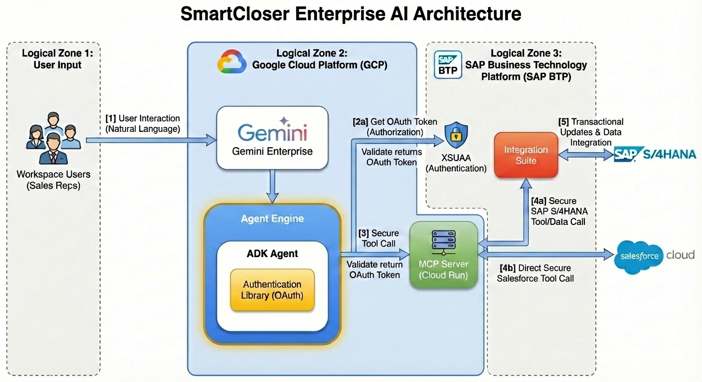
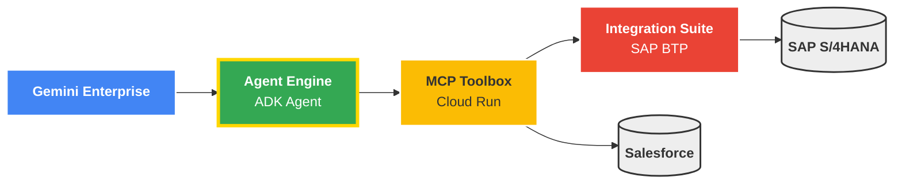
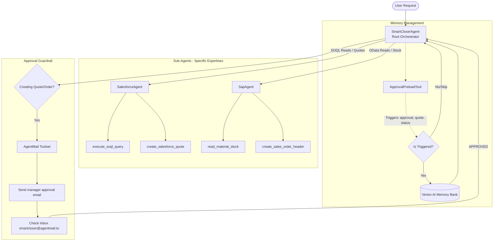
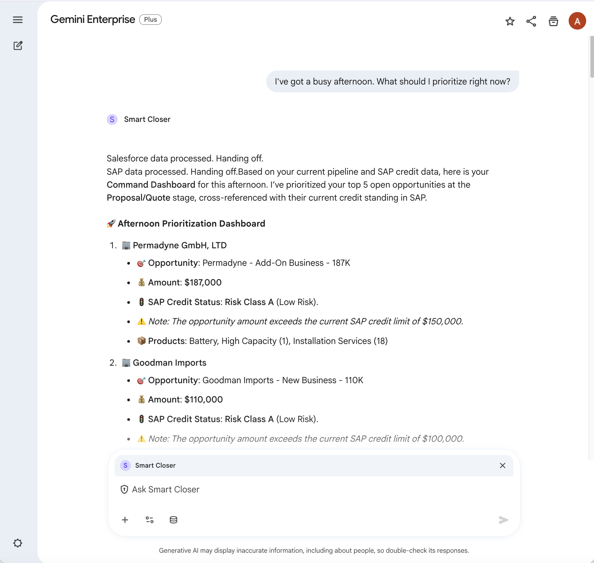
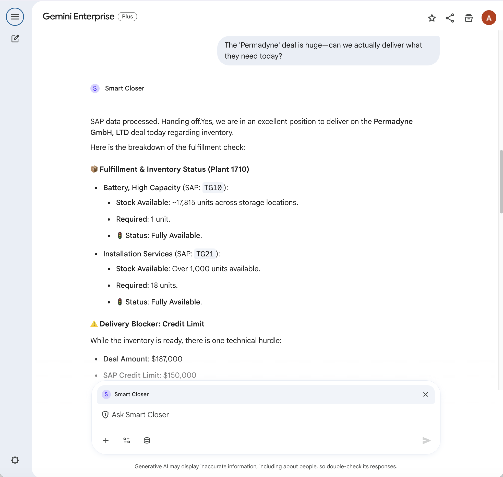
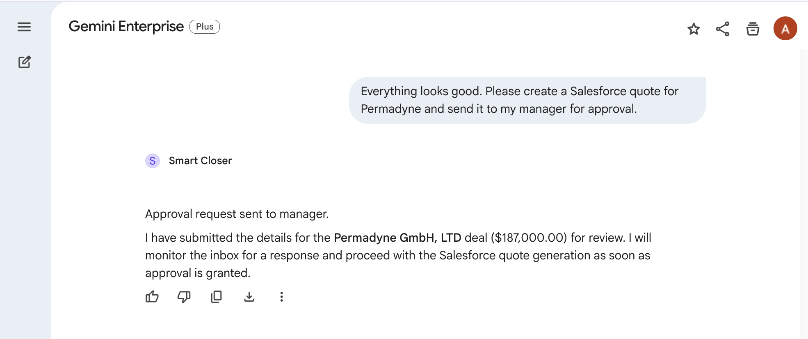

# Smart Closer Agent (Framework Sample)

The **SmartCloserAgent** is a proactive, multi-agent AI system built using the **Google Cloud Agent Development Kit (ADK)**. It is designed to bridge natural language requests into complex execution workflows across **Salesforce** and **SAP (S/4HANA)** for immediate transactional assistance (Quote-to-Cash operations).

> **Note**: This is a **mock implementation** designed as a base framework. It does NOT require live connections to SAP, Salesforce, MCP Toolbox, or AgentMail. All remote integrations have been replaced with internal Python mock tools, making it easy to clone, run, and understand the multi-agent orchestration logic immediately.

## Architecture

This sample demonstrates a **hub-and-spoke multi-agent system**:

- **Smart Closer Agent (Coordinator)**: The root agent responsible for high-level orchestration, user interactions, ID mapping, and handling manager approvals via email.
- **Salesforce Agent (CRM Specialist)**: Dedicated sub-agent for interacting with Salesforce records (Accounts, Opportunities, Quotes).
- **SAP Agent (ERP Specialist)**: Dedicated sub-agent for interacting with SAP S/4HANA resources (Credit Limits, Business Partners, Sales Orders).

## Try the Workflow

You can run this agent out of the box. Try inputs like:
1. "What opportunities do I have open?"
2. "Check the SAP credit status for ACME Corp (Account 001Ws000053hK4jIAE)."
3. "Looks good, can you prepare a Salesforce Quote for that opportunity?"
4. (The agent will mock an email approval process for human-in-the-loop safety).
5. "Great, the quote is approved. Convert it to an SAP Sales order and close the opportunity."

## Prerequisites

- Python 3.10+
- Vertex AI access in your Google Cloud project (Make sure you have `gcloud auth application-default login` set).

## Usage

1. Install dependencies:
```bash
pip install -r requirements.txt
```

2. Run the agent via the ADK CLI:
```bash
adk run
```


---

## 🌟 Art of the Possible: Full Production Implementation

While this sample is a local mock, the original **SmartCloserAgent** was built for the **Google Next 2026** keynote to demonstrate a live, end-to-end production workflow using **Vertex AI Agent Engine**.

In a real enterprise deployment, this exact same ADK codebase bridges secure backend systems using the **Model Context Protocol (MCP)**. 

### High-Level Production Architecture

The production system seamlessly bridges multiple enterprise backends using standard protocols:
- **MCP Toolbox Integration**: The agent securely calls Salesforce and SAP APIs via a centralized MCP Toolbox deployed on Cloud Run.
- **SAP Integration Suite via XSUAA**: SAP OData services are accessed directly via the SAP Integration Suite with robust XSUAA-based authentication.





### Sub-Agent Workflow & Tool Chain

In production, the agent orchestrates an explicit sequence of tool calls across the system:



### Live Demo Previews

**Step 1: Proactive Briefing (Fetching SFDC pipeline and checking SAP credit risk)**


**Step 2: Available-to-Promise Check (Mapping Salesforce Product to SAP Material Stock)**


**Step 3: Human-in-the-Loop Guardrails (AgentMail Approval Workflow)**


### Full Workflow Recording


> **Note**: The screenshots above reference the `/demo/` directory from the original Google Next prototype.

---

### 🚀 Ready to Build This?
This multi-agent system represents the future of autonomous, mission-oriented AI partners. 

**If you want to learn how to transition this framework into a full production environment for your enterprise, please reach out to your Google Account Team!**
