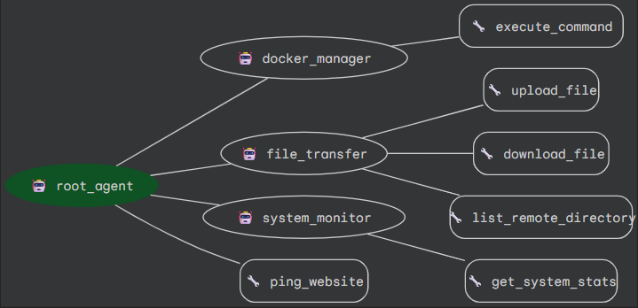

# VPS ADK Agent 🚀

**An intelligent VPS management assistant built with the Google Agent Development Kit (ADK).**



This project provides a multi-agent system to manage your VPS, monitor websites, handle Docker containers, and transfer files securely via SSH. It uses Google's Gemini models to understand natural language commands and execute them safely on your server.

---

## ✨ Capabilities

The system consists of a **Root Agent** that delegates tasks to specialized sub-agents:

### 1. 🌐 Website Monitoring
*   **Direct Check**: Checks if your configured website is UP (200-399 status) or DOWN.
*   **Smart Analysis**: Detects network errors, timeouts, and server errors (500+).
*   **Auto-Config**: Reads target URL from `.env`.

### 2. 🐳 Docker Manager Sub-Agent
**Strictly controlled Docker management via SSH.**
*   `docker ps -a` - List all containers
*   `docker start <name>` - Start a container
*   `docker stop <name>` - Stop a container
*   `docker logs --tail <n> <name>` - View container logs
*   `docker network ls` - List networks
*   `docker volume ls` - List volumes
*   **Security**: All destructive commands (`exec`, `rm`, `run`) are **rejected**.

### 3. 📂 File Transfer Sub-Agent
**Secure SFTP operations with path validation.**
*   **Upload**: Local → Remote (checks for correct filenames)
*   **Download**: Remote → Local
*   **List**: View remote directory contents
*   **Safety**: Validates paths to prevent errors (e.g., ensuring destination includes filename).

### 4. 📊 System Monitor Sub-Agent
**Real-time server health metrics.**
*   **CPU Usage**: % utilization
*   **Memory**: RAM usage
*   **Disk**: Root partition usage
*   **Uptime**: Server running time

---

## 🛠️ Setup Guide

### 1. Prerequisites
*   Python 3.10+
*   A Google Cloud Project with Gemini API enabled
*   An SSH-accessible VPS

### 2. Installation

1.  **Clone/Open the project**
2.  **Create a Virtual Environment**:
    ```bash
    # using uv (recommended)
    uv venv
    .venv\Scripts\activate  # Windows
    # source .venv/bin/activate # Linux/Mac
    ```
3.  **Install Dependencies**:
    ```bash
    uv pip install -r requirements.txt
    ```

### 3. Configuration

1.  Copy the example env file:
    ```bash
    cp VPS_Agent/.env.example VPS_Agent/.env
    ```
2.  Edit `VPS_Agent/.env` with your details:

    ```env
    GOOGLE_API_KEY=your_gemini_api_key
    MONITOR_URLS=https://your-website.com
    
    # SSH Credentials
    SSH_HOSTNAME=your.vps.ip
    SSH_USERNAME=root
    SSH_PASSWORD=your_password
    SSH_PORT=22
    ```

---

## 🚀 Usage

Run the ADK web interface to interact with your agent:

```bash
adk web
```

Then open your browser (usually `http://localhost:3000`) and chat with your agent!

### Example Commands:

*   **"Is my website up?"**
*   **"Show me all docker containers"**
*   **"Restart the 'nginx' container"**
*   **"How is the server health?"**
*   **"Upload C:\Users\me\config.json to /root/config.json"**
*   **"Show me the logs for the database container"**

---

## 🔒 Security Features

*   **Restricted Docker**: Only safe commands are allowed.
*   **Context Managers**: SSH connections are opened only when needed and closed immediately after.
*   **Path Validation**: The file transfer agent ensures you don't accidentally unwanted overwrites or invalid paths.
*   **No Shell Access by Default**: The agents use specific, pre-defined functions rather than open shell access.
