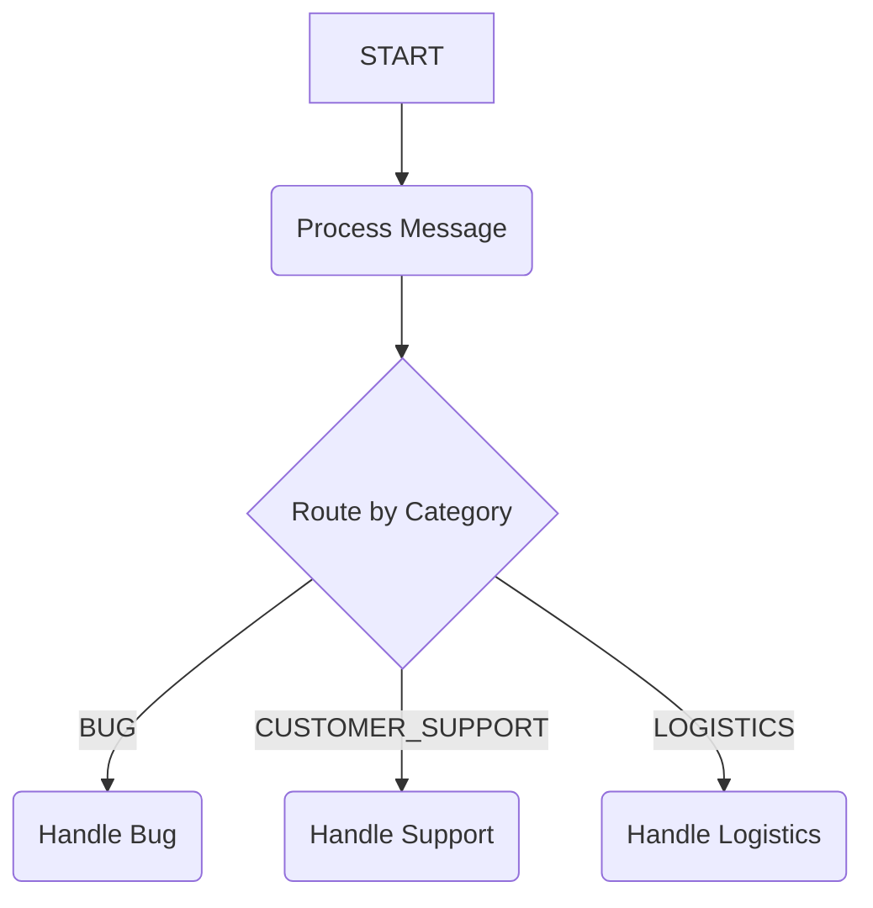

# Concurrent Researcher Workflow

This sample demonstrates a workflow that can execute multiple branches of a graph concurrently based on dynamic, runtime conditions.

## 1. Architecture

The architecture of this sample is a `WorkflowAgent` that classifies a user's message and routes it to one or more handlers.

- **`process_message`**: An `LlmAgent` that starts the workflow by classifying an input message into one or more categories (e.g., "BUG", "CUSTOMER_SUPPORT", "LOGISTICS").
- **`router`**: A Python function that inspects the classification. If the `LlmAgent` returns multiple categories, the router will yield a list of routes.
- **`response_*` functions**: A set of simple Python functions that are executed based on the routes provided by the `router`. If multiple routes are yielded, the corresponding response functions will run in parallel.



The graph is defined with edges that connect the router to each possible response:

```python
edges=[
   ("START", process_message, router),
   (router, response_1_bug, "BUG"),
   (router, response_2_customer_support, "CUSTOMER_SUPPORT"),
   (router, response_3_logistics, "LOGISTICS"),
],
```

## 2. Feature: Concurrent Execution via Dynamic Routing

This sample showcases how a `WorkflowAgent` can perform work concurrently. The key feature is the `router` function's ability to yield an `Event` with a list of routes.

When the `WorkflowAgent` receives an event with multiple routes, it triggers all corresponding downstream nodes simultaneously. This allows for dynamic, parallel execution paths that are determined at runtime based on the input.

This is a powerful pattern for handling complex tasks that can be broken down into sub-tasks that are addressed at the same time.

## 3. Deployment Guide

To deploy this workflow agent, you can use the `adk deploy` command.

### Prerequisites

Ensure you have authenticated with Google Cloud:
```sh
gcloud auth application-default login
```

Your GCP `project` and `location` should be set in a `.env` file in the root of this project.

### Deployment Command

```sh
adk deploy workflow-concurrent_researcher/agent.py:root_agent --display-name "Concurrent Task-Routing Agent"
```

After deployment, you can interact with the agent through the provided endpoint.

### Example Use

After deploying, you can invoke the agent with a message that needs to be classified and handled.

**Example Input:**
```json
{
  "input": "I can't log in to my account and I also need to track my package."
}
```
Because this input contains keywords for both "CUSTOMER_SUPPORT" and "LOGISTICS", the agent will trigger both the `Handle Support` and `Handle Logistics` nodes concurrently.
