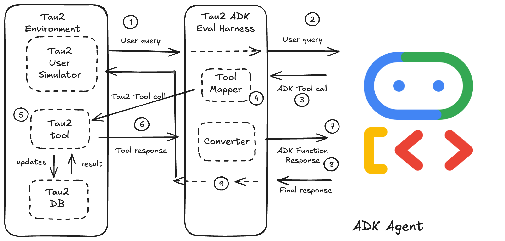

# The Tau2-ADK Evaluation Harness: From "It Works" to "It's Proven"

**The must-have evaluation framework for building production-ready ADK agents.**

## The Challenge: How Do You *Really* Know Your Agent Is Ready for Production?

Building an AI agent with Google's Agent Development Kit (ADK) is straightforward. Proving that it is reliable, safe, and effective is not.

Manual, ad-hoc testing is often:
-   **Subjective**: Based on a few "happy path" conversations.
-   **Incomplete**: Misses crucial edge cases and adversarial user behavior.
-   **Not Repeatable**: Lacks a consistent way to measure if a change made the agent better or worse.

Going to production without rigorous, objective evaluation is a significant risk. How do you prevent regressions? How do you prove the value of upgrading your model? How do you know your agent will follow complex business rules when a user tries to trick it?

## The Solution: A Professional Harness for a World-Class Benchmark

This project provides the critical bridge between your **production-grade ADK agent** and the **sophisticated [`tau2-bench`](https://github.com/sierra-research/tau2-bench) benchmark**.

-   **What It Is**: An evaluation harness that allows you to test agents built with Google's ADK against a suite of complex, stateful, and realistic customer service scenarios.
-   **How It Works**: It acts as an intelligent adapter, translating your agent's native, event-driven architecture into the format expected by the `tau2-bench` evaluation engine.

In short, this project lets you take your agent out of the lab and put it through a rigorous "flight simulator" to prove it's ready for the real world.

## Why Is This Critical for Your ADK Project?

Adopting this framework provides foundational benefits that directly impact quality and reduce risk.

#### 1. Test Your *Actual* Production Code
Vanilla `tau2-bench` and the Google ADK use different agent architectures. Without this harness, you would have to build a simplified, "test-only" version of your agent, which wouldn't accurately reflect its real-world behavior.

**The harness allows you to evaluate the exact `adk.Agent` object you will deploy to production.** You are testing your real code, your real prompts, and your real logic in a controlled environment.

#### 2. Evaluate Core Reasoning, Not Just Tool Execution
A working tool is only a small part of a successful agent. This framework tests the agent's "brain." It answers the most important questions:
-   **Instruction Following**: Does the agent correctly adhere to a multi-page policy document, even when a user pushes against the rules?
-   **Tool Selection & Sequencing**: In a messy, multi-turn conversation, can it identify the correct tool, and then the *next* correct tool, to solve a multi-step problem?
-   **Parameter Extraction**: Does it accurately extract the right arguments (e.g., `product_id`, `user_name`) from ambiguous natural language?
-   **Result Interpretation & State Tracking**: Can it understand a complex API response (JSON, dictionary), integrate that information into its understanding of the conversation, and formulate a correct, helpful next step?

#### 3. Leverage a Rich, Pre-Built Test Suite for Free
The `tau2-bench` tasks are a treasure trove of expertly crafted test cases. Instead of spending weeks creating your own, you get immediate access to dozens of scenarios, including:
-   Users who lie or provide incorrect information.
-   Users who change their minds or introduce new goals mid-conversation.
-   Complex, multi-step tasks that require multiple tool calls.
-   Scenarios designed to test specific policy violations.

This is like having a professional QA team dedicated to finding your agent's weaknesses before your customers do.

#### 4. Achieve Objective, Repeatable Benchmarking
Stop guessing if a change was an improvement. This harness provides a numerical reward score for every evaluation run. This enables you to:
-   **Track Progress**: Get hard data showing your agent's performance is improving over time.
-   **Prevent Regressions**: Add these evaluations to your CI/CD pipeline to catch regressions before they merge.
-   **Compare Models**: Objectively measure the performance lift of switching from one LLM to another (e.g., Gemini 1.5 Flash vs. Gemini 1.5 Pro).

The conversation shifts from "I think this prompt is better" to "This prompt improved performance on adversarial tasks by 15%."

#### 5. Enable Automated Prompt and Model Optimization
Because the harness produces a single, objective score for a suite of tests, it becomes the engine for advanced MLOps workflows. You can move beyond manual A/B testing and build automated pipelines that can:
-   Systematically test hundreds of prompt variations to find the optimal system instruction.
-   Tune tool descriptions and agent strategies algorithmically.
-   Automatically benchmark and select the most cost-effective model that meets your performance target.

This harness provides the foundational measurement layer required to apply data-driven optimization techniques directly to your ADK agents.

## How is this different from ADK's built-in `adk eval`?

The built-in `adk eval` is an excellent tool for "golden set" testing, but it serves a different purpose. Think of it as your project's **unit test suite**, while this harness is the **standardized certification exam**.

| Feature | ADK's `adk eval` (Unit Testing) | Tau2-ADK Harness (Performance Benchmarking) |
| :--- | :--- | :--- |
| **Purpose** | **Regression Testing.** Answers: "Does my agent still produce the *exact same output* for a known input?" | **Problem-Solving Benchmarking.** Answers: "How well can my agent *independently solve a complex problem* from scratch?" |
| **Method** | Compares a new run against a previously saved, "golden" conversation trajectory. | Compares the final outcome against an objective, ground-truth state (e.g., "Was the correct flight booked?"). |
| **Environment** | Assumes static tool behavior. Excellent for testing agent logic in isolation. | Interacts with a **stateful, simulated environment** (e.g., dynamic product databases, user profiles). |
| **Test Cases** | Requires developers to manually create and curate specific test conversations. | Leverages a **pre-existing, curated suite** of dozens of challenging tasks designed to find edge cases. |

---

## FAQ: Answering the Tough Questions

#### Q: "This is great, but our agent's tools are totally different from the ones in `tau2-bench`. How is this useful?"
**A:** This is by design. The harness is not for testing your tool's *implementation*, but your agent's *reasoning*. You use the `harness/tool_mapper.py` file to create a "translation layer" that maps your agent's tools to the benchmark's tools. This process itself is valuable, but the result is a test of your agent's ability to decide *when* to call a tool and with *what* arguments, which is a universal challenge.

#### Q: "Why not just use the vanilla `tau2-bench` project directly?"
**A:** Because they use fundamentally different programming models. This harness treats `tau2-bench` as a **library of assets** (tasks, stateful environments, and scoring logic) rather than an execution engine. The ADK is asynchronous and event-driven, while `tau2-bench` expects a simpler, synchronous agent. This harness provides the essential, non-trivial code in `run_evaluation.py` that bridges this gap. Without it, you would have to build this complex adapter yourself.

#### Q: "The harness seems to be just one small `tool_mapper.py` file. Is that it?"
**A:** `tool_mapper.py` is only the simple **configuration** file. The **engine** is `run_evaluation.py`, a substantial script that orchestrates the entire process: running the ADK agent, managing the async event stream, translating messages, handling the conversational loop, and calculating the final score. The simplicity of the mapper is a feature that makes the powerful engine easy to configure.

#### Q: "This seems like a lot of work to set up. What's the ROI?"
**A:** The return on investment is **confidence and risk reduction**. It's the difference between hoping your agent works and having data that proves it handles a wide range of challenging scenarios correctly. The initial effort of creating the tool mapping or customizing the benchmark pays for itself by preventing production failures, accelerating development cycles, and providing clear, data-driven insights into your agent's quality.

## Your Path to Confident Deployment

1.  **Start Small**: Begin by mapping your agent's tools to an existing `tau2-bench` domain (like `retail` or `airline`). This is a low-effort way to get an immediate signal on your agent's core reasoning.
2.  **Go Pro**: As your agent matures, create a custom benchmark by forking `tau2-bench` and modifying the tools, database, and tasks to perfectly mirror your own environment. This gives you a permanent, high-fidelity asset for ensuring your agent's quality.

Using this harness will fundamentally change how you develop agents. You will move faster, build with more confidence, and create a final product that is demonstrably more robust and reliable.

---

## Technical Documentation & Quick Start

This section provides the original technical details for setting up and running the harness.

### How It Works

The harness sits between the ADK agent and the Tau2 ecosystem, orchestrating the conversation and translating calls between the two frameworks. The diagram below illustrates the flow of information during a single turn where the agent decides to use a tool.



Here is a step-by-step walkthrough of what happens during this process:

1.  **The User Speaks:** The **Tau2 User Simulator**, following its instructions for the current task, generates an initial user utterance (e.g., "I need to find a flight from SFO to JFK tomorrow").

2.  **Harness Forwards to ADK Agent:** The **Harness** receives the message, formats it into an ADK `Content` object, and passes it to your **ADK Agent** to process.

3.  **ADK Agent Decides to Use a Tool:** Your agent's LLM analyzes the user's request. Based on its instructions and the available tool definitions (e.g., `adk_find_flights`), it decides to call a tool. The ADK framework emits this decision as a `FunctionCall` event.

4.  **Harness Intercepts and Translates the Tool Call:** The **Harness** intercepts this `FunctionCall` event. Instead of executing the dummy ADK function, it passes the tool name and arguments to the internal **Tool Mapper**. The mapper translates them into the corresponding Tau2 tool name and argument format (e.g., `adk_find_flights` becomes `search_direct_flight`).

5.  **Harness Executes the *Real* Tool:** The harness executes the *translated* tool call against the stateful **Tau2 Environment**.

6.  **Tau2 Environment Returns a Result:** The Tau2 Environment processes the request (e.g., queries its internal flight database) and returns a raw result (e.g., a list of Pydantic `Flight` objects).

7.  **Harness Forwards the Result to the ADK Agent:** The **Harness** receives the raw result from the Tau2 Environment. It formats this result into an ADK `FunctionResponse` object, typically by serializing it to a dictionary or JSON string that the ADK agent's LLM can understand. This is sent back to the agent to inform its next step.

8.  **ADK Agent Formulates a Response:** Your **ADK Agent**'s LLM processes the tool result and generates a natural language response for the user (e.g., "I found three available flights for you...").

9.  **Harness Delivers Response to the User:** The **Harness** captures this final text response and passes it back to the **Tau2 User Simulator**, completing the turn. The user simulator then evaluates the agent's response and generates its own reply, continuing the conversation.

### Features

**Key Features:**
*   **Dynamic Agent Loading:** Point the harness to your ADK agent file and variable.
*   **Runtime Policy Injection:** Automatically injects the Tau2 domain policy into your ADK agent's instructions for each task.
*   **Extensible Tool Mapping:** A simple, centralized mapping system in `harness/tool_mapper.py` translates tool and argument names between the ADK and Tau2 frameworks.
*   **Full Trajectory Capture:** Captures the complete conversation in Tau2's data format for reliable evaluation.
*   **Sample Agent Included:** Comes with a working sample agent for the `airline` domain to get you started immediately.

### Prerequisites

1.  **Python 3.8+**
2.  A working installation of **Tau2 Bench**. This harness relies on its environment and evaluation libraries. Please follow the [Tau2 Bench installation guide](https://github.com/sierra-research/tau2-bench#installation) first.
3.  **API Keys:** The harness and the underlying frameworks use LLMs. You must provide API keys in a `.env` file in the project's root directory.

    Create a file named `.env` and add your keys:
    ```bash
    # .env file
    GOOGLE_API_KEY="your-google-api-key"
    OPENAI_API_KEY="your-openai-api-key"
    # ... and any other keys for your desired LLM provider
    ```

### Installation

1.  Clone the repository:
    ```bash
    git clone <repository_url>
    cd tau2-adk-harness
    ```

2.  Install the required Python packages:
    ```bash
    pip install -r requirements.txt
    ```

### Quick Start

You can run an evaluation on the included sample agent against the Tau2 `airline` domain.

```bash
python run_evaluation.py \
  --domain airline \
  --adk_agent_path sample_adk_agents/airline/agent.py:root_agent \
  --user-llm gemini-1.5-flash \
  --num-tasks 1
```

**Command Breakdown:**
*   `--domain airline`: Specifies the Tau2 domain to run against.
*   `--adk_agent_path ...`: Provides the path to the ADK agent file and the variable name of the agent instance (`file:variable`).
*   `--user-llm ...`: The LLM to power the Tau2 user simulator. A powerful model like Gemini 1.5 Pro or GPT-4 is recommended for realistic user behavior.
*   `--num-tasks 1`: Runs only the first task for a quick test.

### How to Use the Harness

#### 1. Evaluating Your Own ADK Agent

To evaluate your custom ADK agent, follow these steps:

1.  **Ensure your agent is defined in a Python file.** For example, `my_company/agents/booking_agent.py` might contain a variable `flight_booker_agent = Agent(...)`.

2.  **Map your agent's tools to Tau2's tools.** Open `harness/tool_mapper.py` and add or update the mapping for the domain you are targeting. For example, if your agent's tool for finding flights is named `search_for_flights`, you would map it to Tau2's `search_direct_flight` in the `airline` domain config.

3.  **Run the evaluation script,** pointing it to your agent:
    ```bash
    python run_evaluation.py \
      --domain airline \
      --adk_agent_path my_company/agents/booking_agent.py:flight_booker_agent \
      --user-llm gemini-1.5-flash
    ```

#### 2. Adding Support for a New Tau2 Domain

Extending the harness to support another Tau2 domain (e.g., `telecom`) is straightforward:

1.  **Inspect the Tau2 Domain's Tools:** Use the Tau2 CLI to see the available tools and their signatures for the new domain:
    ```bash
    tau2 domain telecom
    ```
    This will open a ReDoc page with the domain's policy and tool API documentation.

2.  **Update the Tool Mapper:** Open `harness/tool_mapper.py` and add a new entry to the `DOMAIN_CONFIGS` dictionary.

    ```python
    # harness/tool_mapper.py

    def map_telecom_arguments(adk_tool_name: str, adk_args: dict) -> dict:
        # Add logic here if ADK argument names differ from Tau2's
        # For example: map 'phoneNumber' to 'phone_number'
        if 'phoneNumber' in adk_args:
            adk_args['phone_number'] = adk_args.pop('phoneNumber')
        return adk_args

    DOMAIN_CONFIGS = {
        "airline": {
            # ... existing airline config
        },
        "telecom": {
            "tool_map": {
                # ADK Tool Name : Tau2 Tool Name
                "adk_get_customer_by_phone": "get_customer_by_phone",
                "adk_suspend_line": "suspend_line",
                # ... other telecom tool mappings
            },
            "arg_mapper": map_telecom_arguments
        }
    }
    ```

3.  **Create your ADK agent** with the tool signatures you defined (e.g., `adk_get_customer_by_phone`) and run the evaluation against the `telecom` domain.